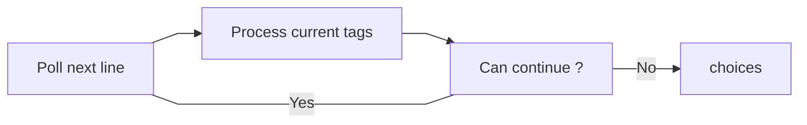

import { Image } from 'astro:assets';

I ran a [Mothership TTRPG](https://www.tuesdayknightgames.com/pages/mothership-rpg) one shot recently and thought it could do with some fancy terminal running on an iPad at the center of the table. I wrote one using inkle's [Ink](https://www.inklestudios.com/ink/) narrative language and [Svelte](https://svelte.dev/).
<Video src={import("./banner.mp4")} />

# Context and requirements



# Ink language and integration

lines, choices, continue
tags
external functions

```ink
-> boot

= boot
#speed 5
TRAC PC-9800 Series System Terminal
Reythorne OS Version 6.20
Copyright (C) 2981, 2987 Reythorne Corp. /
  TRAC Corporation

EEEE I3000000032940xf100110303B77500EEEE
I400000004294_M8_BL1_10221D113B323EEEE5
no sdio debug board detected 
TE : 102609
BT : 11:30:18 Mar 14 2314
                              
Boot From SPI      
#clear                                                             
ucl decompress...pass                                                           
0x12345678                                                                      
Boot from internal device 1st SPI                                               
 
TE : 512897    
-> start        

= start
System Started                  
#speed 40
.........................
#delay 100
#speed 40
ENTER PASSWORD
####
-> main

= main
#clear
Greta base  #title
+ Diagnostic
  -> diagnostics ->
+ Controls
  -> controls ->
+ Comms
  -> comms ->
+ Reboot
  -> boot
- -> main

= diagnostics
Generator [off]
backup generator [off]
+ [back] ->->

= controls
Airlock [closed]
 #delay
->->

= comms
Comms [off]
 #delay
->->

```

# Visuals
