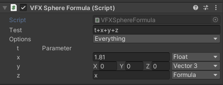

I recently implemented the famous Marching Cubes algorithm ([Wikipedia](https://en.wikipedia.org/wiki/Marching_cubes)) using density function to describe the terrain ([GPU Gems chapter about that](https://developer.nvidia.com/gpugems/gpugems3/part-i-geometry/chapter-1-generating-complex-procedural-terrains-using-gpu)). Having to recompile the code to tweak the density function was too slow, so I wrote a fast expression evaluator for Unity, available on [GitHub](https://github.com/theor/BurstExpressions).

<Video src={import("./header-1.m4v")} />

<YouTube id="h3Tax5hBx6w" />

# Overview

Expressions work on `float3` values. Any computation expecting a float will use the `x` coordinate.

An expression has fixed parameters provided by the code using it (e.g., the time `t` or an index `i`). Any name in the expression that is not a function or a parameter creates a named value, which is either a constant or a nested formula.


The string input gets parsed as an AST, which is then converted to a flat array of instructions. That array is evaluated.

In terms of workflow:

- declare a `Formula` object and its fixed parameters
- it gets compiled to an `EvaluationGraph` instance once
- in the editor, there's another call to recompile the formula when it changes enabling live-edit during playmode
- evaluation is Burst compatible

Another video, this time using expressions as the density function of a dual contouring implementation:

<YouTube id="HEW5E6rlZAA" />

Here is a full sample from the repo (see on [Github](https://github.com/theor/BurstExpressions/blob/main/.Samples/Assets/FormulaTest.cs)):

```csharp
public class FormulaTest : MonoBehaviour
{
    public Formula Test;
    private EvaluationGraph _evalgraph;

    public void Reset()
    {
        if (Test == null) Test = new Formula();
        Test.SetParameters("t", "pos");
    }

    private void Start() => Test.Compile(out _evalgraph);

    private void OnDestroy() => _evalgraph.Dispose();

    private void Update()
    {
        // stripped in player builds
        Test.LiveEdit(ref _evalgraph);

        var parameters = new float3[2];
        parameters[0] = Time.realtimeSinceStartup;
        parameters[1] = transform.localPosition;
        Evaluator.Run<Evaluator.DefaultOps>(_evalgraph, parameters, out var res);
        transform.localPosition = res;
    }
```

# Parsing

The parser is a standard Shunting-Yard ([Wikipedia](https://en.wikipedia.org/wiki/Shunting-yard_algorithm)) implementation I had from a previous project, that outputs an AST. An excerpt:

```csharp
public struct ExpressionValue : IAstNode
{
    public readonly float F;
}
public struct Variable : IAstNode
{
    public readonly string Id;
}
public struct FuncCall : IAstNode
{
    public readonly string Id;
    public readonly List<IAstNode> Arguments;
}
```

That AST is then translated to its runtime data format. This is when function/variable binding happens and nested formulas are injected:

```csharp
EvaluationInstruction[] nodes = Translator.Translate(
    astRoot,
    new List<NamedValue>
    {
        new NamedValue("x"){Value = new Vector3(42f, 0, 0)}
    },
    // parameters
    new List<string>{"t"},
    // are named values actually used ?
    out var usedValues);
```

Function names and arity are extracted from the `EvalOp` enum: its member `Abs_1` make it possible to parse a function `abs` with one argument. That enables a basic form of overloading (e.g., declaring `Min_2` and `Min_3`).

# Evaluation

The result of the conversion is an expression in reverse Polish notation (RPN). RPN (also known as _postfix notation_) is, quoting [Wikipedia](https://en.wikipedia.org/wiki/Reverse_Polish_notation),, "a mathematical notation in which operators follow their operands [...] It does not need any parentheses as long as each operator has a fixed number of operands.".

An expression in infix notation like `(2 + 3) * 4` will be noted `2 3 + 4 *`. RPN is trivial to evaluate using a stack: most opcode will only push and pop from that stack. A `multiply` operator just does `push(pop() * pop())`.

The previous expression uses 3 types of instructions:

```asm
Const 2
Const 3
Add
Const 4
Mul
```

The "flat array" mentioned earlier is a `NativeArray` of instructions. Here is the definition:

```csharp
public struct EvaluationInstruction
{
    // An enum with one value for each instruction
    public EvalOp Op;
    // a float3 value for CONSTANT instructions
    public float3 Val;
    // an index for LOAD and PARAM instructions
    public byte Index;
}
```

At this point, the evaluation of simple expressions is trivial. Here is the core loop of the evaluation engine:

```csharp
// input: EvaluationGraph graph;
UnsafeList<float3> stack = /* ... */;
for (int current = 0; current < graph.Length; current++)
{
    var node = graph.Nodes[current];
    switch(node.Op)
    {
        case EvalOp.Constant:
            Push(stack, node.Val);
            break;
        case EvalOp.Multiply:
            Push(stack,
                Pop(stack) *
                Pop(stack));
            break;
        // ...
    }
}
return impl.Stack[impl.Stack.Length - 1];
```

## Parameters and nested expressions

Parameters are provided to the evaluator as a `float3` array, which is indexed by the `Param` instruction using its `byte Index`.

In the case of nested expressions, there are two cases:

- If the expression resolves to a simple constant, it is inlined. For a set of expressions `x = 42; y = x; result = 2*y` the resulting instructions are `CONST 2; CONST 42; MUL`
- Otherwise, the formulas are evaluated at the beginning of the program, their result left on the stack, then each usage is an instruct `LOAD $stackIndex` that reads the expression result in the stack and pushes it again on top. For example, given `x = 42 * 2; result = x * x`, the result is:

```asm
CONSTANT 42
CONSTANT 2
MUL // pushed 84 at index 0 on the stack
LOAD 0 // push 84
LOAD 0 // push 84
MUL
```

# Optimization

There's also a pass of constant folding, which tries to pre-compute as many nodes in the evaluation graph, which is compatible with the inlining of trivial nested expression. When enabled, an expression like `x = 2 * 3; result = x * x` will output one `CONST 36` instruction.

This is done using a custom evaluation loop that tracks foldable instructions. There are a few things that could be improved:

- non-trivial nested expressions that output a `LOAD $index` instruction are not folded for now
- instructions with no effect (e.g. `x + 0` or `x * 1`) or a constant effect (`x * 0` or `pow(x, 0)`) could be detected and folded

I need to benchmark another approach, which would be to reduce the instructions in the flat array to the opcode and the `byte index` only, and move the `float3` constants to a separate array. I _think_ the extra indirection is not worth the 12 bytes saving, but I might be surprised. Another variation would be to push those constants on the stack and then load them from there using the existing `LD` instruction.

# Extensibility

When using the package as it, it isn't extensible for now. The easiest solution is just to duplicate the code and add new members to the `EvalOp` enum, then a new switch case to the evaluation function.

I have considered multiple solutions to this :

- any form of dynamic dispatch is complex to implement efficiently with Burst (no struct inheritance, casting a struct to its implemented interface is a boxing operation)
- static dispatch is possible, with some generics and bitmasking: if operators are implemented with an `interface IOpTable { void Execute(...); }`, it is possible to combine multiple implementation with two tricks:
  - first, assign a index for each implementation, let's say on 4 bits to allow 16 different optables. `or` that index as the most significant bits in the opcode (opcode `1` from the third implementation would become `0b0011_000000000001`)
  - then combine optables statically:

```csharp
struct Switcher<T1, T2> : IOpTable where T1 : struct, IOpTable where T2 : struct, IOpTable
{
    public void ExecuteOp(in Node node, ref EvalStack stack)
    {
        // get the optable index
        var opMask = (node.Op & 0xF000) >> 12;
        if (opMask == 0)
            default(T1).ExecuteOp(node, ref stack);
        else // recurse and delegate to T2
        {
            Node copy = node;
            copy.Op = (ushort)((node.Op & 0x0FFF) | ((opMask - 1) << 12));
            default(T2).ExecuteOp(copy, ref stack);
        }
    }
}
```

It's just a matter of making parsing and translation aware of those various tables... which is doable, but knowing when to invalidate the already translated data becomes tricky.

- codegen has perks and drawbacks. Generating the optable from all available implementations is doable, but would make it tricky to inject new tables in, let's say, another library using the same expression evaluator.

I decided to stick to the copy-and-tweak approach for now.

# Performance

First, a note on what I consider acceptable performance in that case: fast enough to allow rapid iteration without a major performance impact. Of course YMMV, but as any data-driven implementation, it is slower than raw code.

Benchmark: 100 evaluations of `new float3(math.cos(input * 16), 0, math.sin(input * 12))` (200 measurements, 10 iterations per measurement + warmup)

| Test                             | Time (ms) | Compared to fastest Burst | Compared to fastest non-Burst |
| -------------------------------- | --------- | ------------------------- | ----------------------------- |
| Code Job, Burst, Single Threaded | 0.02      | **1x**                    | 0.2x                          |
| Code Job, Burst, Parallel        | 0.02      | **1x**                    | 0.2x                          |
| Code, No Burst, Single Threaded  | 0.10      | 5x                        | **1x**                        |
| Eval Job, Burst, Parallel        | 0.13      | 6.5x                      | 1.3x                          |
| Eval Job, Single Threaded        | 0.13      | 6.5x                      | 1.3x                          |
| Eval, No Burst, Single Threaded  | 0.73      | 36.5x                     | 7.3x                          |

Bursted code is hard to beat. So, to summarize:

- For low-frequency evaluation (10 times/frame), the difference will be hard to notice
- Bursted expression evaluation is on par with non-bursted code
- Even for high-frequency events, it might be worth it for the iteration speed, even if that means replacing it with the hard-coded formula before shipping (or maybe keeping the expression behind an `#ifdef`).

# Conclusion

I'm quite happy with the result. Definitely not something I'd ship on a critical path, but I think I'll reuse it a lot when experimenting with anything requiring many iterations, visual, AI, ... I hope it will be useful to someone else !
