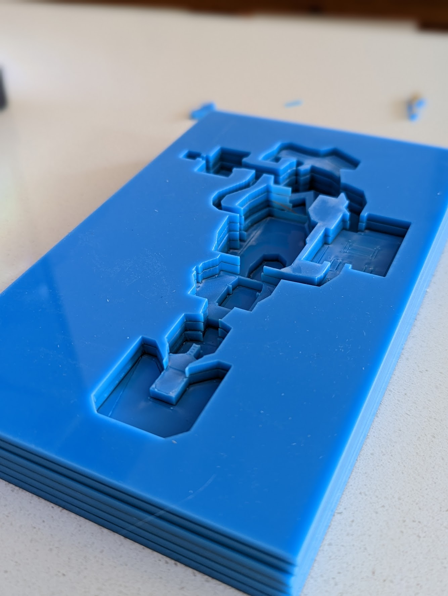

import { Image } from 'astro:assets';
import case1 from "./case1.webp";
import case2 from "./case2.webp";
import case3 from "./case3.webp";
import halton1 from "./halton-11.svg";
import halton2 from "./halton-17.svg";
import halton3 from "./halton-23.svg";
import halton4 from "./halton-1_5-11.svg";
import halton5 from "./halton-1_5-17.svg";
import halton6 from "./halton-1_5-23.svg";
import e1m1 from "./E1M1.svg";

I've heard a lot about classic Doom's data format and decided to write some Rust code to extract its maps and convert that to vector graphics I could laser cut. 

I'll go through the process, from the data extraction to the geometry reconstruction to outputting laser-cuttable SVGs, including the geometrical dead end I enthusiastically ran to when I tried to preview the result using [bevy](https://bevyengine.org/).


# DOOM WAD format

DOOM's data was designed with modding as a goal : the entire game is an executable and a `.WAD` data pack. The shareware/demo version shipped with DOOM1.WAD, which is still available freely.

<Video caption="Doom WAD format, illustrated with MotionCanvas" width="100%" height="auto" src={import("./wad.m4v")}/>

The WAD format is well documented - see the [Unofficial DOOM spec](https://www.gamers.org/dhs/helpdocs/dmsp1666.html) or the [ZDoom wiki](https://zdoom.org/wiki/WAD). The gist of it is :
- the WAD file starts with a header follow by the actual data, ends with directory entries describing that data
- the header contains a pointer to the first directory entry and the entry count
- each directory entry contains a pointer to the data and its size

<Box>
I'll skip some (fascinating!) details, as the [DOOM game engine black book](https://fabiensanglard.net/gebbdoom/) of the wonderful Fabien Sanglard already covers all of that.
</Box>

Those data items are called "lumps" in doom parlance. Some contains map geometry, others textures, sounds, text, ... everything needed for a game. 

A map is described by multiple lumps
- `VERTEXES` is a list of world positions
- `LINEDEFS` describes lines joining two segments and references one SIDEDEF per line "side"
- `SIDEDEFS` are "walls", textures for a line, and belong to a SECTOR
- `SECTORS` are polygons with a floor and ceiling height

The map data also includes a BSP tree whose leaves are subsectors, sectors split to be convex polygons, but also texture definitions compositing multiple sprites and much more.

## Implementation

I used [nom](https://github.com/rust-bakery/nom), a rust parser combinators library that can parse text and binary formats. Here is a typical usage: parsing `THINGS`, the map items/power ups:

```rust
pub struct Thing {
    pub pos_x: i16,
    pub pos_y: i16,
    pub angle: i16,
    pub thing_type: u16,
    pub flags: ThingFlags,
}

impl Lump for Thing {
    // used to determine how many items in a lump
    const SIZE: usize = 10;
}

pub fn parse_thing(input: &[u8]) -> IResult<&[u8], Thing> {
    map(
        // parse 5 unsigned shorts
        tuple((le_i16, le_i16, le_i16, le_u16, le_u16)),
        // map them to the struct fields
        |(pos_x, pos_y, angle, thing_type, flags)| Thing {
            pos_x,
            pos_y,
            angle,
            thing_type,
            flags: ThingFlags::from_bits(flags).unwrap(),
        },
    )(input)
}
```

I have a nice `parse_lump` function in a WAD struct, taking the lump name and the parsing function :
```rust
let things: Vec<Thing> = wad.parse_lump("THINGS", thing::parse_thing);
```

# Geometry

Getting line segments is relatively easy (group `linedefs` by `sidedef.sector`). However, I also intend to group sectors by similar floor heights to reduce the layer count and I need to mark edges as cut or engrave lines if they are polygon borders or internal lines. 

The parsed WAD data is an unordered collection of edges. We have a guarantee that edges won't cross. Merging polygons is just a set union, and removing internal lines is a matter of finding duplicate edges in a polygon.

Strictly speaking, this is enough to produce a SVG that can be laser cut.

# Reducing the layer count

It is now time to separate sectors into layers, according to their floor height. This is done by providing an array of heights and grouping sectors by the smallest upper bound, eg. I used `[-70, -24, 0, 40]` for E1M1.

It could be automated, but I went for artistic control. Sectors could be sorted by ascending height, then split into groups of similar size. That group size could be in function of sector counts or areas. Another criteria could be the sector properties - if a sector is flagged as causing damage (acid, lava...) it could deserve its own layer.

Mayne I'll investigate later ; my gut feeling is that this problem is related to [Map coloring](https://en.wikipedia.org/wiki/Map_coloring).

# Writing SVG

I've used the [svg crate](https://crates.io/crates/svg) in previous experiments. It is barebone, with no attribute type, but works.

For laser cutting, I need :
- one color for each layer
- another for _internal lines_ that I intend to engrave
- another for _positioning lines_. Some layers contain loose parts I'll need to correctly position before glueing them ; the positioning lines draw those pieces'position on the layer underneath.

This is the result for E1M1, with the internal lines in red and the positioning lines in cyan:
<Image src={e1m1} alt="E1M1 SVG"/>


## Interlude: Halton sequence

I spent a lot of time generating svgs with various colors to validate my work. I reused a trick I'm fond of to generate semi-random colors: using a Halton sequence output as the hue of a `HSL` color.

```rust
// base, f are parameters here
let mut halton = halton::Sequence::new(base);

for i in 0..sectors.len() {
    let color = colorsys::Hsl::from((
        // hue 0-360
        (h * 360.0 * f) % 360.0,
        // saturation 0-100
        80.0,
        // lightness 0-100
        50.0
    )).to_css_string();
}
```

It is similar to using a pseudorandom generator with a fixed seed, but the Halton sequence is more evenly distributed. Here is the result for 100 values with a few base/f combinations :

<div class="gallery">
<Figure caption="base = 11 , f = 1" src={halton1} />
<Figure caption="base = 17 , f = 1" src={halton2} />
<Figure caption="base = 23 , f = 1" src={halton3} />
<Figure caption="base = 11 , f = 1.5" src={halton4} />
<Figure caption="base = 17 , f = 1.5" src={halton5} />
<Figure caption="base = 23 , f = 1.5" src={halton6} />
</div>

# Today's rabbit hole: 3D rendering and triangulation

Things were too simple at this point, so, of course, I found something. It all started when I thought, "wouldn't it be great if I could preview the stacked laser cut layers in 3D".

I bootstrapped a simple Bevy app. To render the layers, I need to triangulate them. It happens there's a [triangulate crate](https://crates.io/crates/triangulate), but it comes with constraints.

First, let's look at the DOOM polygons three cases:

1. a _simple_ polygon, which has a specific definition ([Wikipedia](https://en.wikipedia.org/wiki/Simple_polygon)) :
    - exactly two edges meet at each vertex
    - the number of edges equals the number of vertices

<Image src={case1} width="400" alt="[Case 1, a simple polygon]" />

2. one polygon with holes (called "weakly simple polygons" in the most basic case akin to a disc). This means the sector represents multiple polygons where one contains the others
<Image src={case2} width="400" alt="[Case 1, a simple polygon]" />

3. multiple polygons sharing one vertex - to be accurate multiple polygons where each pair share at most _one_ contiguous vertex, which makes it a _complex_ polygon. The fact that the edges intersections are vertices means the polygon can be split into simple polygons.
<Image src={case3} width="400" alt="[Case 1, a simple polygon]" />


The `triangulate` crate (and, AFAIK, all other implementations) needs actual paths - an _ordered_ list of vertices. It also does not support non-simple polygons, which excludes case 3.

To rebuild a path from the unordered list of edges, my initial approach was to pick an edge, then find any edge connected to it. This works for cases 1 and 2, but not for the last one, as those polygons have more than two edges meeting at some vertices.

<Video width="10" noloop src={import("./badtris.mp4")}/>

The solution to that problem is to rebuild paths by repeatedly finding the shortest loop from an edge, which is equivalent to finding all loops where no vertex is used more than once per loop:

<Video noloop  src={import("./goodtris.mp4")}/>

If a doom sector contains multiple loops, it means it falls either in case 2 or 3. To figure it out, we can rely on empiric assumptions :
- Cases 2 and 3 are exclusive - meaning if a vertex is shared, it must not be a hole. only I'm not _sure_ this is true
- it also means that if a loop contains another, it is the outer loop of a polygon with holes

I went with the latter, using the [geo rust crate](https://crates.io/crates/geo) which has extensive support for polygon operations.

I got that to work eventually:


The issue is that I now need to invert those polygons, as I want to subtract them to an enclosing rectangle - meaning boolean operations (also supported by `geo`), but now the triangulation fails.

## Subsector attempt

But wait, the WAD does contain simple, convex polygons, right ? The result of the binary space partitioning. It does, but those polygons sometimes have _implicit_ edges defined by the partition lines. I started working on that, then realized that was too much sidetracking. It should work however. Maybe later...

## Backtracking

I gave up on that approach at this point. The solution to the preview, a very valid problem, was simpler: use [TinkerCad](https://www.tinkercad.com/) to import the svg layers, extrude them, stack them export a .glb I could render in blender. That's how I rendered the banner of this article. Note that tinkercad's SVG import do expect proper SVG paths and not disjoint lines ; so part of that work did serve to produce a cute render.


# Final Result

Just have to glue it now ! I definitely need to try it with clear acry lic or with multiple colors.


