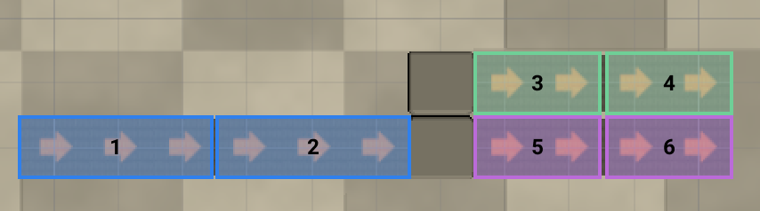
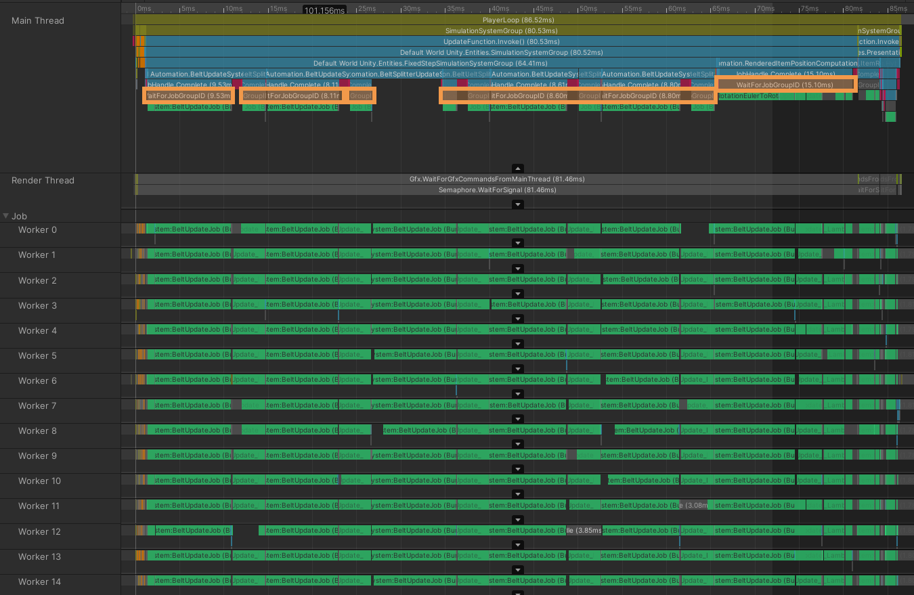

I was curious to see if I could implement belts like in Satisfactory or Factorio with DOTS in a performant manner. In the end, my implementation is highly parallel and works at 60fps for a million items, but let's start with a deep dive into how both games do it.

<Video src={import("./Loop-1.webm")} />

Versions used:

- Unity 2020.2.1f1
- Entities 0.17.0-preview.41
- Hybrid Renderer 0.11.0-preview.42
- Burst 1.5.0
- URP 10.2.2
- DOTS Editor 0.12.0-preview.6

# Satisfactory and Factorio

Both games might seem similar, but there are a few key differences between their approaches:

- In Satisfactory, a belt has exactly one entry point and one exit point : it always connect one machine's exit to another's entry, including mergers and splitters. A belt has one lane of items


- In Factorio, belts have two lanes of items. A belt can drop its content on another belt without needing any extra machine

<Video src={import("./Factorio-1.m4v")} caption="Credit: Factorio wiki" />

Given that there are two item lanes, it means only two belts need to be considered at any point for a merge.

If you look closely at the Factorio gif, you'll notice items get teleported to the destination belt when leaving the source belt, probably because it avoids a bunch of problems - having to reserve a spot on the target belt and freeze items already there while the item would be inserted. Given that Satisfactory always do its merging hidden from view in a merger, they completely sidestepped the issue.

The Satisfactory approach strongly reduces dependencies in terms of processing: each belt between two machines can be processed in parallel. Machines can be processed in parallel. Worst case, there is a frame delay introduced by the machine that can be justified in-game by the fact that the machine itself introduces a delay. That frame delay can probably be avoided by trying to catch up when outputting items.

We'll still need to process a belt's segments in reverse order to ensure that, when updating a segment, the next segment is already up to date.

Factorio has more data dependencies. It seems, according to [that blog post](https://www.factorio.com/blog/post/fff-151), that they split the world into chunks, split each chunk into a 3x3 grid, then update all cells #1 in parallel, then all cells #2, etc. making the process 9 sequential steps, each massively parallel, and one final single-threaded step to reconcile deltas recorded for each chunk.

I didn't want to spend _that_ much time on the topic, so I went with the Satisfactory design. However, there is still a lot to learn from Factorio.

# Factorio's Belt Representation

The Factorio blog is fantastic, I highly recommend reading it. In [this post](https://www.factorio.com/blog/post/fff-176) the devs describe how belts are implemented and it makes a lot of sense:

- belts are split into segments that might spawn multiple cells
- a belt segment has a reversed list of items, starting at the end of the belt
- each item only stores the distance to the next item and its type for the rendering

That means that updating a belt comes down to decreasing the distance of the last item on the belt that can move. I'll just show the blog post illustration:

<Video
  src={import("./factorio-belt-implem.m4v")}
  caption="Credit: Factorio blog"
  height="75px"
/>

Pushing that further, it also means that items don't need an actual object/entity for the simulation.

Given that we'll implement something closer to Satisfactory, the only point where an item can be inserted is the start of the belt. We'll split belts too long (for rendering), a splitter/merger will also split a belt into separate segments, and we'll store the distance from the insertion point to the next item to quickly know if there is room on the next segment when an item reaches the end of the previous one.

Let's start with the item type:

```csharp
public enum ItemType : byte
{
    None,
    PaintBucket,
    HardHat,
}
```

<Box title="A note on default values">

The `None` value as the first one is a very intentional point of design. I tend to implement any value type such as `default(T)` is an invalid value. When I work with indices in lists, I tend to add a sentinel value at index 0, meaning any `0` index is either invalid or uninitialized. In some cases, differentiating the two can be useful, and I'll use `Int.MaxValue` as the invalid value.

Let's say `PaintBucket` was the first value: now any uninitialized ItemType will equal `PaintBucket`. Great.

</Box>

A belt segment has a start position, an end, the distance to use when inserting an item and a couple of entity references used to update segments in order:

```csharp
struct BeltSegment : IComponentData
{
    public int2 Start;
    public int2 End;
    public Entity Next;
    public Entity Prev;
    public ushort DistanceToInsertAtStart;
    // ...
}

// for later:
struct BeltSplitter : IComponentData { /* ... */ }
```

Note that storing both the start and end point could be optimized - for the sake of premature optimization, we _could_ decide to store only the length of the belt,and in a separate field, its rotation. In a 2d game, that rotation would be 2 bits. If we decided to cap the length of a belt to 64, we could store it and the two bits of rotation in a byte. Of course all of that is pointless until we actually profile the code and determine that it's worth it.

DOTS provides a way to attach multiple payloads of the same type on an entity: [Dynamic Buffer Components](https://docs.unity3d.com/Packages/com.unity.entities@0.17/manual/dynamic_buffers.html). That's how we'll attach items on segments:

```csharp
struct BeltItem : IBufferElementData
{
    public ItemType Type;
    public ushort Distance;
}
```

The distance is divided by a constant in a singleton component, `Settings.BeltDistanceSubDiv`, to get the actual distance in world units. If that constant is set to 16, each update will move the item 1/16th of a unit. An item moving 1 unit forward will see its `Distance` field reduced by 16.
Note that a distance of 0 means "The item will be transferred to the next segment." For a belt without a next belt, the item stopped at the end of the belt would actually have a distance of `BeltDistanceSubDiv`. Measuring the distance from the segment's drop point will make a few things simpler down the line.

# Belt Update

In that case, there are 6 different segments, belonging to three belts, each with its own color:


We'll update each belt in parallel, starting from its last segment, going backward:

| Thread | First Segment Updated | Second One |
| ------ | --------------------- | ---------- |
| 1      | 2                     | 1          |
| 2      | 4                     | 3          |
| 3      | 6                     | 5          |

Meaning, we need to identify those last segments. We'll tag any segment whose next element is not another segment. To determine if an entity has a component from a job without having to fetch that data, we can use an `EntityQueryMask`:

```csharp
var beltSegmentMask = GetEntityQuery(ComponentType.ReadOnly<BeltSegment>()).GetEntityQueryMask();
var lastSegments = new NativeList<Entity>(Allocator.TempJob);
Entities.ForEach((Entity e, in BeltSegment s) =>
{
    if (s.Next == Entity.Null || !beltSegmentMask.Matches(s.Next))
        lastSegments.Add(e);
})
// one thread - only happens at initialization, and the NativeList cannot add elements in parallel if it has to resize the list
    .Schedule(Dependency)
    .Complete();
EntityManager.AddComponent<LastBeltSegment>(lastSegments);
lastSegments.Dispose();
```

We just need the segment before the one we're updating to crawl back the chain:

```csharp
var segments = GetComponentDataFromEntity<BeltSegment>();

Entities.ForEach((Entity e, DynamicBuffer<BeltItem> dynamicBuffer, ref BeltSegment segment) =>
{
    Entity next = segment.Next;
    if (next != Entity.Null && beltSegmentMask.Matches(next))
    {
        Entity nextBeltSegment = segments[next];
        nextBeltSegment.Prev = e;
        segments[next] = nextBeltSegment;
    }
}).Run();
```

Now the belt update itself. For each last segment, look for the first item still moving and move it. If that move might transfer the item to the next segment, check that there's room to accommodate it.

```csharp
[BurstCompile]
struct BeltUpdateJob : IJobFor
{
    public World.Settings Settings;

    public NativeArray<Entity> SimulationChunksLastSegment;

    [NativeDisableContainerSafetyRestriction]
    public ComponentDataFromEntity<BeltSegment> Segments;

    [NativeDisableContainerSafetyRestriction]
    public BufferFromEntity<BeltItem> Items;

    public void Execute(int index)
    {
        Entity e = SimulationChunksLastSegment[index];
        int iter = 0; // see the note after this code block
        do
        {
            if(iter++ >= 1000000)
                throw new NotImplementedException();
            BeltSegment segment = Segments[e];
            DynamicBuffer<BeltItem> items = Items[e];

            for (int i = 0; i < items.Length; i++)
            {
                ref BeltItem item = ref items.ElementAt(i);

                // simple case, too far from belt end to care about a next segment
                if (item.Distance > Settings.BeltDistanceSubDiv)
                {
                    item.Distance--;
                    segment.DistanceToInsertAtStart++;
                    Segments[e] = segment;
                    break;
                }

                // no next segment, so BeltDistanceSubDiv is the min distance
                // continue to move the next item on the belt
                if (segment.Next == Entity.Null)
                {
                    continue;
                }

                // only move if the next segment has room
                var nextBeltSegment = Segments[segment.Next];
                if (nextBeltSegment.DistanceToInsertAtStart == 0)
                    continue;

                if (item.Distance > 0) // still inserting onto the next segment
                {
                    item.Distance--;
                    segment.DistanceToInsertAtStart++;
                    Segments[e] = segment;
                }
                else if (InsertInSegment(ref Items, ref Segments, item, segment.Next))
                {
                    // remove the item from this segment, update again at index i
                    items.RemoveAt(i);
                    i--;
                }

                break;
            }

            // crawl the chain
            e = segment.Prev;
        } while (e != Entity.Null);
    }
}
```

And that's it. Of course the complete code is a bit trickier as it also handles belt-to-splitter item transfers, but that's the gist of it.

<Box title="Escape hatches">

About `if(iter++ >= 1000000) throw`:
Whenever I write a loop with no clear exit, I learned to put an iteration counter and throw if it exceeds an arbitrary threshold. In non-burst C#, you might be able to interrupt a loop by putting a breakpoint and editing variables, but that's impossible with burst if you haven't enabled native debugging first.

</Box >

The `[NativeDisableContainerSafetyRestriction]` attributes are here because we think we know what we're doing, as a segment is supposed to belong to one belt at a time, and because we would not allow loops were we to build an actual game or something. Loops would deserve a special case anyway : think of what would happen with a looping belt completely packed.

# Rendering

The belts and splitters themselves are rendered using the [Hybrid Renderer V2](https://docs.unity3d.com/Packages/com.unity.rendering.hybrid@0.11/manual/index.html) package and URP. The items, however, are quite a specific case:

- Item rendering screams "Instancing". In my case, only 2 meshes, each rendered thousands of times
- They don't need per-instance culling. If a belt is visible, draw all of its items.

So I decided to give a try at drawing them using `Graphics.DrawMeshInstancedProcedural`, which allows to provide a `GraphicsBuffer` for the instanced parameters that is filled with a `NativeArray`.

First, we need a `bool Rendered` in each segment. We'll compute the frustum planes of the camera, a raw AABB box for each segment and cull those not visible. It starts simply:

```csharp

// OnCreate
_cameraPlanes = new NativeArray<float4>(6, Allocator.Persistent);

// OnUpdate
FrustumPlanes.FromCamera(camera, _cameraPlanes);
Dependency = Entities.ForEach((ref BeltSegment s) =>
{
    AABB sAABB = s.AABB;
    s.Rendered = FrustumPlanes.Intersect(cullingPlanes, sAABB) != FrustumPlanes.IntersectResult.Out;
}
    .WithNativeDisableParallelForRestriction(cullingPlanes)
    .ScheduleParallel(Dependency);
```

At the same time, we'll count how many items of each type are rendered, so we'll modify the code we just wrote:

```csharp

// only two types of items for now, paint bucket and hard hat
const int ItemTypes = 2;

RenderedItemCount = new NativeArray<int>(2, Allocator.Persistent);
var countPtr = (int*)RenderedItemCount.GetUnsafePtr();

Dependency = Entities.ForEach((DynamicBuffer<BeltItem> items, ref BeltSegment s) =>
{
    AABB sAABB = s.AABB;
    s.Rendered = FrustumPlanes.Intersect(cullingPlanes, sAABB) != FrustumPlanes.IntersectResult.Out;
    if (s.Rendered)
    {
        int* perItemTypeCount = stackalloc int[ItemTypes];
        UnsafeUtility.MemClear(perItemTypeCount, UnsafeUtility.SizeOf<int>() * ItemTypes);

        // count items of each type
        for (int i = 0; i < items.Length; i++)
            // Remember how the first EntityType value is none ? skip it
            perItemTypeCount[items[i].Type - 1]++;

        // one interlocked.add per type
        for (int i = 0; i < ItemTypes; i++)
            Interlocked.Add(
                ref UnsafeUtility.ArrayElementAsRef<int>(countPtr, i), perItemTypeCount[i]);
    }
})
.WithNativeDisableUnsafePtrRestriction(countPtr)
.WithNativeDisableParallelForRestriction(cullingPlanes)
.ScheduleParallel(Dependency);

```

Now we need to create one `NativeArray<float3>` per item type and compute each position. This one is trickier: to store an array of float3 arrays, we'll need a `float3**`, which will be filled with the burst-compatible, thread-safe equivalent of `position[index++] = pos`. Given that we have multiple arrays and indices, it will rather look like `index = IndexPerType[itemType]++; RenderedItemPositions[itemType][index] = pos`:

```csharp
// actual arrays
public NativeArray<float3>[] RenderedItemPositions;
// pointer to each native array's pointer
private unsafe float3** _renderedItemPositionsPointer;
// next index to fill per item type
public NativeList<int> itemPositionArrayIndexPointer;


// OnCreate
RenderedItemPositions = new NativeArray<float3>[2];
_renderedItemPositionsPointer = (float3**) UnsafeUtility.Malloc(
    UnsafeUtility.SizeOf<IntPtr>() * 2,
    UnsafeUtility.AlignOf<IntPtr>(),
    Allocator.Persistent);
_itemPositionArrayIndex = new NativeList<int>(2, Allocator.Persistent);
_itemPositionArrayIndex.Add(-1);
_itemPositionArrayIndex.Add(-1);

// OnUpdate
// we *need* the item count per type to be ready
_cullingSystem.CountDependency.Complete();

// foreach item type
for (var index = 0; index < _cullingSystem.RenderedItemCount.Length; index++)
{
    // (re)create the native array
    if (!RenderedItemPositions[index].IsCreated || _cullingSystem.RenderedItemCount[index] != RenderedItemPositions[index].Length)
    {
        if (RenderedItemPositions[index].IsCreated)
            RenderedItemPositions[index].Dispose();
        RenderedItemPositions[index] = new NativeArray<float3>(_cullingSystem.RenderedItemCount[index], Allocator.Persistent);
    }
    // assign the pointer
    _renderedItemPositionsPointer[index] = (float3*) RenderedItemPositions[index].GetUnsafePtr();
    // reset the count
    _itemPositionArrayIndex[index] = -1;
}
```

Now the job itself:

```csharp
[BurstCompile]
struct ComputePositionsJob : IJobChunk
{
    public World.Settings Settings;

    [ReadOnly]
    public ComponentTypeHandle<BeltSegment> BeltSegmentsHandle;
    [ReadOnly]
    public BufferTypeHandle<BeltItem> BeltItemsHandle;

    [NativeDisableUnsafePtrRestriction]
    // "things I hoped I wouldn't have to do in C#"
    public unsafe float3** _renderedItemPositionsPointer;

    [NativeDisableContainerSafetyRestriction]
    public NativeList<int> itemPositionArrayIndexPointer;

    public unsafe void Execute(ArchetypeChunk chunk, int chunkIndex, int firstEntityIndex)
    {
        NativeArray<BeltSegment> segments = chunk.GetNativeArray(BeltSegmentsHandle);
        BufferAccessor<BeltItem> allItems = chunk.GetBufferAccessor(BeltItemsHandle);
        for (int chunkIdx = 0; chunkIdx != chunk.Count; chunkIdx++)
        {
            BeltSegment segment = segments[chunkIdx];
            if (!segment.Rendered)
                continue;

            DynamicBuffer<BeltItem> items = allItems[chunkIdx];
            float dist = 0;
            int2 dropPoint = segment.DropPoint;
            int2 revDir = segment.RevDir;
            for (int i = 0; i < items.Length; i++)
            {
                BeltItem item = items[i];
                // accumulate the distance for each item
                dist += item.Distance / (float) Settings.BeltDistanceSubDiv;
                // distance is relative to the drop point AFTER the end of the belt
                float3 computePosition =
                    new float3(dropPoint.x + dist * revDir.x, 0, dropPoint.y + dist * revDir.y);

                byte itemTypeIndex = (byte) (item.Type - 1);

                // get the item type index ref
                ref int instanceIndexRef = ref itemPositionArrayIndexPointer.ElementAt(itemTypeIndex);
                // get the current index
                int index = Interlocked.Increment(ref instanceIndexRef);

                _renderedItemPositionsPointer[itemTypeIndex][index] = computePosition;
            }
        }
    }
}
```

And we're almost done. It's just a matter of drawing each item type now. For that, I had to hack an URP shader with instancing support ; ShaderGraph doesn't support that yet. See [this part of the shader](https://github.com/theor/Automation/blob/master/Assets/Item%20Shader.shader#L181)

```csharp
for (var index = 0; index < renderedItemCount.Length; index++)
{
    NativeArray<float3> itemPositions = renderedItemCount[index];
    if (itemPositions.Length == 0)
        continue;

    // recreate graphics buffwers
    buffer = new GraphicsBuffer(GraphicsBuffer.Target.Structured, itemPositions.Length, 12);
    buffer.SetData(itemPositions);

    var materialPropertyBlock = new MaterialPropertyBlock();
    // name of the structured buffer in the shader
    materialPropertyBlock.SetBuffer("_AllInstancesTransformBuffer", _graphicsBuffers[index]);

    // prefabs, without surprise, contains a bunch of prefabs converted to entities
    var m = EntityManager.GetSharedComponentData<Unity.Rendering.RenderMesh>(index == 0
        ? prefabs.ItemPrefab
        : prefabs.Item2Prefab);

    Graphics.DrawMeshInstancedProcedural(m.mesh, 0, m.material,
        // computing a proper encompassing AABB would be the right thing to do
        new Bounds(Vector3.zero, Vector3.one*10000),
        nativeArray.Length,
        materialPropertyBlock);
}
```

And that's it. Culling demo:
<Video src={import("./cullingdemo.mp4")} />

# Performance

| Setup                                                          | Total Items | Average Frame Time (Update+Rendering) |
| -------------------------------------------------------------- | ----------- | ------------------------------------- |
| 100 000 \* 1 belt with 13 items, into a splitter, into 2 belts | 1 300 000   | 11ms                                  |
| 100 000 belts chained, 100 items                               | 10 000 000  | 10ms                                  |

# Improvements

In no specific order:

- Rendering could be massively improved
  - I didn't take the time to dig into the Hybrid Renderer to optimize it for item rendering, probably by skipping the HR batch update mechanism and using the [InstancedRenderMeshBatchGroup](https://docs.unity3d.com/Packages/com.unity.rendering.hybrid@0.4/api/Unity.Rendering.InstancedRenderMeshBatchGroup.html) API directly
  - Item rendering could spare some memory per item by sending an `float2` as coordinates, or even computing their position on the GPU directly. I'm not that familiar with compute shaders etc. so I'll leave that as an exercise for the reader.
  - Belt rendering would probably benefit from [StaticOptimizeEntity](https://docs.unity3d.com/Packages/com.unity.entities@0.4/api/Unity.Entities.StaticOptimizeEntity.html), as the transform system takes a lot of CPU time
- Belt update:
  - In real-world conditions, it would need to be batched and/or time sliced. Updating half of the distant belts but at twice the rate could work. Lots of edge cases.
  - Too many `jobhandle.Complete()` in the actual code. Look at that:
  
- Data representation:
  - In Satisfactory, belts are probably stored as bezier curves
  - Implementing Factorio's two-lane belts with random merge points would take a lot more effort, especially given how well the game runs
  - I'm not satisfied with the `BeltSubdivision` mechanism. Still thinking I could store a distance using grid cell units and a separate `subcell distance`

# Conclusion

I can't stress enough how far this demo is from an actual game implementation, but I'm still satisfied with the result. Burst is still an impressive piece of tech, and I can't wait to see where DOTS and the hybrid renderer are going. That was a fun project. The project is [available here on github](https://github.com/theor/Automation/tree/master/Assets/Scripts). A last video:

<Video src={import("./demo.mp4")} />
