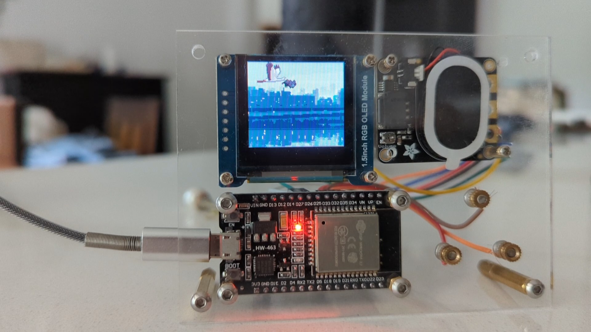
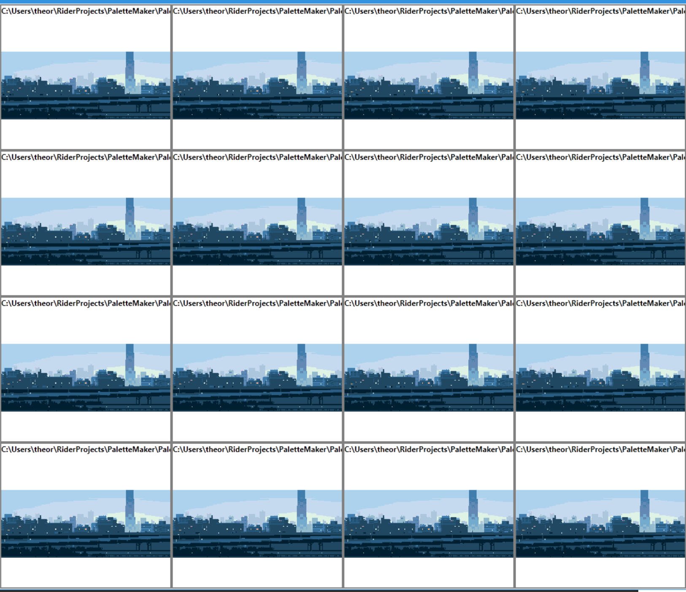
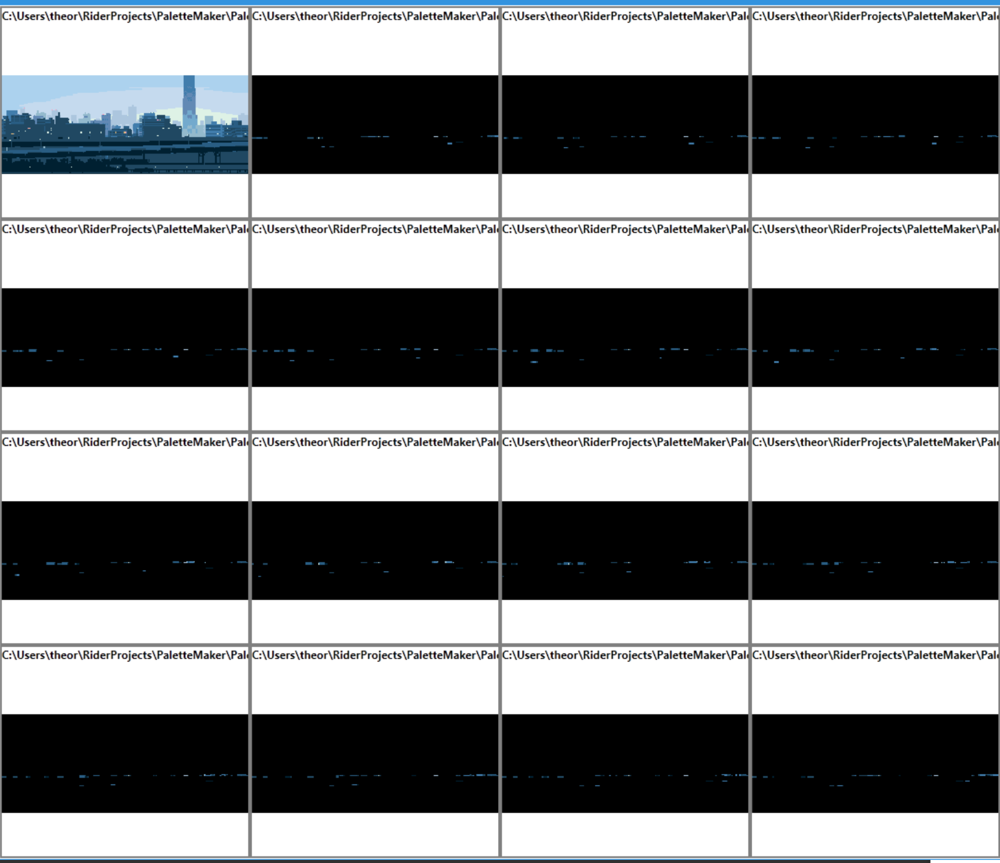
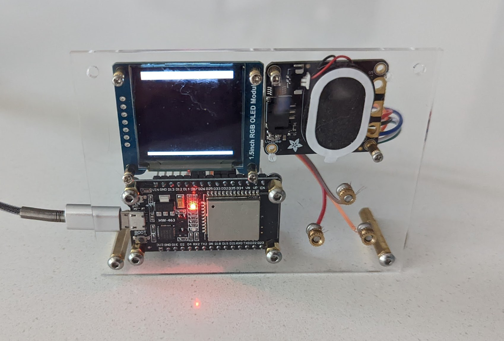

I’ve been tinkering with arduino-like platforms recently (more on the midi synth soon) and got the idea to make a small message board to leave notes to my girlfriend. This is how I ended up with a simulator, an integration with a demoscene tracker, custom tools to make palette cycling effects, having to learn CAD to make a laser-cut front panel and more.



# A very sensible plan

At first, I had a simple goal: Use an ESP32 (240mhz, 512k RAM, luxury !) and a SSD1306 display (128x64, monochrome). Use the ESP WiFi to change the message remotely. That was easy enough : the SSD1306 is supported by the [Adafruit-GFX](https://learn.adafruit.com/adafruit-gfx-graphics-library) library, which makes simple rendering trivial.

I initially pulled the messages from a github-hosted txt file, which required a constant WiFi connection. I then reversed the whole thing and got the ESP32 to store the message in its EEPROM. Holding a 'secret' capacitive button starts a small web server with a primitive form to change the message. Not having to wait for a connection skips a 3-15 seconds loading time at start-up. This is the web server package: https://github.com/me-no-dev/ESPAsyncWebServer

To avoid adding a power button, the board goes to sleep : when hibernating, it consumes less than 5 uA. The capacitive button on the front wakes it up.

I then started experimenting with fancier scenes : at first, particles showering the message, then I got into animations and...

# Iteration speed: flashing times and OTA

At this point, the flashing time got into the 40s range. To iterate on animation timing and sprite positioning, it’s less than ideal ; working at Unity, it’s like having to recompile the engine when moving an object. 

I discovered the ESP32 it flashable over-the-air (OTA) using WiFi or bluetooth. There’s a neat package adding OTA upload to the web server: [AsyncElegantOTA](https://github.com/ayushsharma82/AsyncElegantOTA) . You can then ’curl’ the firmware after the build to it.

## A dead-end: wasm3 runtime

The ESP32 has a nice little file system using the flash as storage, [SPIFFS](https://docs.espressif.com/projects/esp-idf/en/latest/esp32/api-reference/storage/spiffs.html). An interpreter loading code from there would completely circumvent the flashing step, leaving only a (quicker) file upload. Lua, MicroPython etc... seemed heavier than needed given the task at hand. WebAssembly is a great candidate, and lets the user choose which language to use, as long as it compiles to WASM.

I have a prototype using the fantastic [Wasm3 interpreter](https://github.com/wasm3/wasm3), which can run on embedded mcus : see the [Embedded Wasm Apps](https://github.com/wasm3/embedded-wasm-apps) repo. I used [AssemblyScript](https://www.assemblyscript.org/), which is basically typescript-to-wasm, to output a web assembly binary, that would get ’curl’ed to the web-server, giving me hot-reloading on save. Quite a nice workflow ! The one painful part is having to write bindings manually. I didn’t find a tool to do so ; I’m sure it will happen, if it hasn’t already. A project close to my goals is [WASM-4](https://wasm4.org/), which I definitely need to investigate later.

We’re getting into [Fantasy console](https://en.wikipedia.org/wiki/Fantasy_video_game_console) territory : if you’re interested, here is a short list of interesting platforms:
- [Pico8](https://www.lexaloffle.com/pico-8.php) is the most impressive one - it doesn’t run on embedded, but has an integrated sprite and tile editor, a music tracker, etc. Paid, closed source
- [PixelVision8](https://pixelvision8.itch.io/pv8) is an open-source C# platform, quite close to Pico8 in terms of features. Supports Lua too, no embedded either
- [Wasm4](https://wasm4.org/) apparently runs on MCUs: see [Twitter](https://twitter.com/alvaroviebrantz/status/1518343016011943939)

## A simulator with SDL2

In parallel, I started working on a desktop simulator - a SDL2 window displaying the same scenes. I copy-pasted files and hacked them around until it worked. It gives me an even faster iteration loop AND debugging, at the cost of accuracy (at least in terms of performance).
<Video src={import("./simulator.webm")} />
I still had to restart the app every time I changed a timing/position/..., but it’s a 2-second long loop. Better !

## GNU rocket: demoscene tracker

I then got a flashback : years ago, I stumbled upon [GNU Rocket](https://github.com/rocket/rocket), which is a "sync-tracker", a kind of primitive video editing tool. Your program/demo declares a bunch of tracks : a track outputs a float value that varies according to time, eg. interpolating the x axis of a sprite position from  0 to 10 between the frames 12 and 36.

At authoring time, the Rocket client will connect to an editor, in which you can scrub time and edit values :

<Video src={import("./rocket-scrub.webm")} />

From the editor, you can then send an ’export’ command. It will save the data, in my case on the SPIFFS file system. The rocket client, if not connected to an editor, will open these files and play them, which is what I do in my "production" build.

In the simplest case, I have the client step linearly through time - it just moves forward. In some cases, the time change is itself an artefact of user interactions, allowing to rewind the timeline ; in another case, I have a rocket track which is itself interpreted as playing/pausing/looping the timeline.

## Rocket editor

The bundled editor uses Qt. It’s a great framework ; I have scars from building it.

I found [Emoon’s editor], which is a SDL2 app. Great, not DPI-aware, very small font. I eventually hacked [Ground Control](https://github.com/edoreshef/ground-control) (fork [here on my github](https://github.com/theor/ground-control)) to add font scaling, a more readable font and color palette (IMO) and a bunch of small fixes: 

<Video src={import("./GroundControl.webm")} />

# Upgrading to a color display

Monochrome, 128x64 is limiting - I aimed for a grayscale display initially, but eventually settled on a [SSD1351](https://www.adafruit.com/product/1431) OLED display, 128*128px by 16-bit colors.

My first realization was that, if Adafruit-GFX’s SSD1306 implementation was buffered, the 1351 one wasn’t. I switched to [TFT-eSPI](https://github.com/Bodmer/TFT_eSPI), a more complex but more optimized library. It has a sprite class, that I use as a back buffer. The scene writes everything there, then it’s sent once to the actual display.

I settled on 4-bit indexed bitmaps, with a 16 colors palette *per bitmap*, meaning I can have more than 16 colors on the screen in the end. The raw power of the ESP is enough to compensate for the lack of dedicated graphics hardware and gives me >40fps pre-optimization.
Then I hit the usual wall: making art is hard and not what I’m good at. So as usual, I threw more code at it, on top of using the right tools for the job.

## Tooling for palette-indexed bitmaps

[aseprite](https://www.aseprite.org/) is a fantastic pixel art editor and supports both indexed palettes and animation. It allowed me to reuse bitmaps I found and constrain them to 16 colors. I then wrote a small WPF tool (old habits...) to visualize palette swaps, eg. interpolating the palette to fake a day-night cycle:

<Video src={import("./PaletteMaker.webm")} />

It also exports the palette and the bitmap as C header files, ready to be included in the project:

```cpp
static const uint16_t river1_palette[16] = { 
    0x0841, 0xFFFF, 0x5901, 0x7182,
    0xCE17, 0x8C0F, 0x62EB, 0x3145,
    0x0000, 0x0000, 0x0000, 0x0000,
    0x0000, 0x0000, 0x0000, 0x0000
};
```

```cpp
// 222 x 39 px
static const uint8_t bmp_river1[1545] PROGMEM = {
    0x06, 0x00, 0x19, 0x01, 0xB1, 0xDD, 0x01, 0x01,
    // ...
}

static const SpriteInfo spr_river1 = { bmp_river1, 222,39, 1545 };
```

Palette swapping and cycling are decades-old tricks - see the [RasterScroll Sega MegaDrive/Genesis doc here](https://rasterscroll.com/mdgraphics/graphical-effects/palette-swapping/).

I highly recommend that [GDC talk from Mark Ferrari](https://www.youtube.com/watch?v=aMcJ1Jvtef0), artist on The Secret of Monkey Island and, more recently, [Thimbleweed Park](https://store.steampowered.com/app/569860/Thimbleweed_Park/), going into details about those kinds of tricks and the tooling to make them. If you just want a quick demo, see his [palette cycling demo here](http://www.effectgames.com/demos/canvascycle/). A quick sample: 

<Video src={import("./ferrari-cycling.webm")} />

## RLE compression and delta encoding algorithm

Let’s consider another background image: ’222*89 px / 2 (4 bits per pixel) = 9879b’. Which is alright given the space available on the ESP32 but it does slow down the flashing (assets as SPIFFS files/hot reloading is something I forbade myself to get into) and... I just could not let it go.

I went with a simple RLE encoding. That frame goes from 9879 bytes to 2279 bytes, 23% of the original size. 

I also have animations :



Instead of storing the whole frame every time, I decided to just store the delta to the first frame. Matching tooling:



Each subsequent frame went down to ~100 bytes on average. Quite a gain.

It’s not my first foray into compression : see the [URL encoding of my unicode graph editor](/unicode-graphs/)

# Adding sound ?

I’m now experimenting with the [ESP8266Audio](https://github.com/earlephilhower/ESP8266Audio) lib (which also works with the ESP32). Very promising - it even supports .mod files. I’ m running it through an [Adafruit STEMMA Speaker](https://www.adafruit.com/product/3885), which is way enough. More to come later about that

# Laser-Cutting a Front Panel

I recently found that the fantastic [lespacemaker](https://www.lespacemaker.com/) maker space is really close to my place - and they have a laser cutter. First draft using acrylic :  Maybe I’ll make it a full case eventually... This was made using [CadQuery](https://cadquery.readthedocs.io/en/latest/), a python lib to CAD using code. I did try Fusion, Sketch up and more (too button-clicky, found myself dreaming about writing a plugin), openscad (too slow) and a few others, but in the end...

# Conclusion : On Scope-Creep and Rabbit Holes

No one knowing me will be surprised that this whole thing went down a deep and twisted rabbit hole. That’s alright ; unlike a few years ago, I eventually "shipped" something that ended up our very own kitchen counter. I also learned a lot in a various fascinating subjects (I2C vs SPI, capacitive buttons debouncing, palette cycling, etc.).

All of that definitely happened because it wasn’t a work project.

I think scope creep is alright when learning ; it gives you a wider rather than deeper knowledge, which can be valuable too. *Controlled* scope creep can lead to better products, at a greater risk. The risk evaluation is the critical part here.
