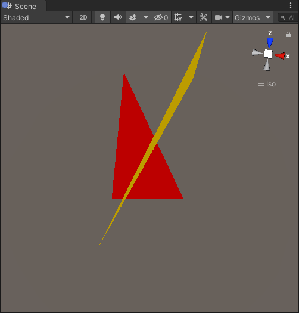
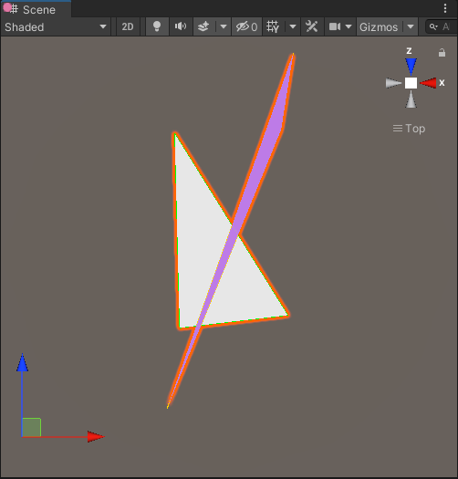
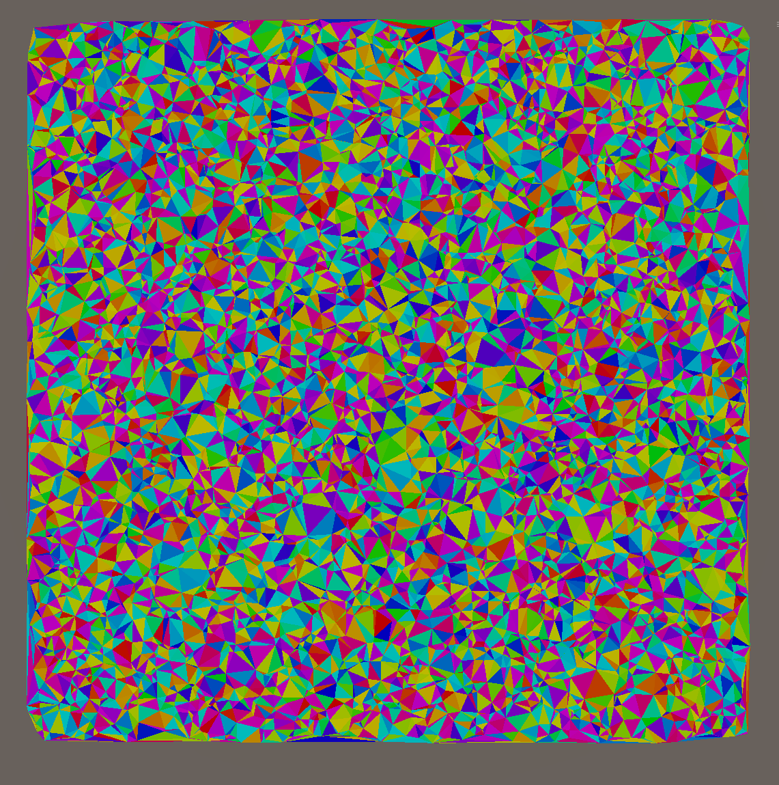

In the last part, we ended up with a collection of random 2D points. Now it's time to triangulate them. After an overview of what a Delaunay triangulation is, we'll describe the Bowyer-Watson algorithm and write a custom data structure to store the triangles, then we'll generate a mesh from it.

Note that a full triangulation, in that case, is a bit over-the-top. I could have started with a grid of points, split each grid cell in two triangles, and add a bit of jitter to them. However it would be a bit too uniform and definitely not as fun. I also had a long-standing feud with Delaunay and Voronoi I wanted to settle.

## Delaunay Triangulation

For a given set of points, there are many possible triangulations. A Delaunay triangulation has a set of very specific properties : according to [Wikipedia](https://en.wikipedia.org/wiki/Delaunay_triangulation) the main one is that "no point in P is inside the circumcircle of any triangle". In layman's terms, it means that it prefers the _prettier_ triangles and avoids [sliver triangles](https://en.wikipedia.org/wiki/Glossary_of_computer_graphics#sliver_triangle) with extremely acute angles and a long/thin shape.


The Delaunay triangulation is the dual of the Voronoi diagram : if you have one, you can compute the other. In this series I won't use Voronoi, but know that it's a staple of procedural generation. If you want to know, go read [Amit's excellent article on Voronoi-based map procedural generation](http://www-cs-students.stanford.edu/~amitp/game-programming/polygon-map-generation/).

## Bowyer-Watson algorithm

There are many algorithms to compute a Delaunay triangulation. We'll implement the [Bowyer-Watson algorithm](https://en.wikipedia.org/wiki/Bowyer%E2%80%93Watson_algorithm), an incremental algorithm.

Here is a simplified explanation of how it works:

- start with an empty triangle set
- create a triangle large enough to contain all points of the set (the "super triangle")
- add points one by one
- when adding a point, find the existing triangles it intersects with ("bad triangles"). Intersecting, in that case, means "the point is inside the circumcircle of the triangle"
- remove the intersecting triangles
- find the boundary of the polygon formed by those intersecting triangles and create new triangles formed edges of the polygon and the new point
- remove triangles containing a vertex of the initial "super triangle"

Let's run the algorithm. The blue triangle is the so-called "super-triangle" that will contain all points we want to triangulate.


We pick the first point to consider.


It intersects with the circumcircle of the super triangle, so we'll delete it.


We now create 3 triangles by connecting each edge of the deleted triangle to the point under consideration.


Let's consider the next point.


It intersects with the circumcircles of the two upper triangles.


We'll delete both, find the edges of the polygon formed by these two triangles, and create new triangles by connecting each edge to the point.


This is the result to date.


Let's add a few more points:


And finally delete all triangles sharing a vertex with the initial super-triangle:


We'll first implement the algorithm and assume we have a burst-compatible data structure to add and remove triangles.

## Vertex storage

To implement the algorithm, we'll need a burst-compatible data structure with the following capabilities:

- A resizable list of triangles. Each triangle is, to its core, a tuple of 3 vertices. We'll reference the points by their index in a list of points.
- A method to add a vertex to the internal vertex list
- One to add a triangle using its three vertex indices
- Another to remove a triangle using its index in the triangle list

The `triangle` struct will also contain references to the neighbor triangles and a few helpers to get its edges easily. `Burst` only supports value types, so no references for use. We could assign unique ids to triangles/vertices/... but we already have some, as long as we don't remove items from their respective collections: indices. That means we won't ever remove triangles from the list. Instead, we'll flag them as `Deleted`. The next optimization will be to keep deleted triangles indices in a list to reuse them when creating a new triangle, but let's keep that for later.

When working with IDs, especially with Burst, I tend to use the id `0` as the null value. This means that any uninitialized id is easily spotted as invalid. For that reason, I'll add a deleted triangle to the triangle list in the storage's constructor.

We'll also cache the triangle's circumcircle center and squared radius, as they'll be used a lot by the Bowyer-Watson algorithm and others down the line.

Last point worthy of a remark: we'll keep a consistent winding order for the triangles created. Short-term, it will make visualizing the triangles in 3d easier ; long-term, it will be a critical requirement for polygon processing down the line.

Here is the `triangle` definition:

```csharp
public struct Triangle
{
    // vertex indices (in consistent winding order)
    public readonly ushort V1;
    public readonly ushort V2;
    public readonly ushort V3;

    public readonly float3 CircumCircleCenter;
    public readonly float CircumCircleRadiusSquared;

    // neighbor triangle indices
    public ushort T1, T2, T3;

    public bool IsDeleted;

    public Triangle(TriangleStorage storage, ushort v1, ushort v2, ushort v3)
    {
        V1 = v1;
        V2 = v2;
        V3 = v3;
        T1 = 0;
        T2 = 0;
        T3 = 0;
        IsDeleted = false;

        Geometry.CircumCircle(storage.F3(v1), storage.F3(v2), storage.F3(v3),
            out CircumCircleCenter, out var circleRadius);
        CircumCircleRadiusSquared = circleRadius * circleRadius;
    }

    public Edge Edge1 => new Edge(V1, V2);
    public Edge Edge2 => new Edge(V2, V3);
    public Edge Edge3 => new Edge(V3, V1);

    public bool ContainsVertex(int v) => V1 == v || V2 == v || V3 == v;
}
```

The `vertex` and `edge` structs are simple:

```csharp
public struct Vertex
{
    public float2 Position;
    public ushort TriangleIndex;
}

public readonly struct Edge : IEquatable<Edge>
{
    // Vertex indices
    public readonly ushort A;
    public readonly ushort B;

    public Edge(ushort a, ushort b)
    {
        A = a;
        B = b;
    }

    // (A,B) == (B,A)
    public bool Equals(Edge other) => A == other.A && B == other.B || A == other.B && B == other.A;
    // skipped: rest of the IEquatable implementation
}
```

Now, let's start the implementation of the `VertexStorage` with its data and ctor/dtor:

```csharp
public struct TriangleStorage
{
    public NativeArray<Vertex> Points;
    public NativeList<Triangle> Triangles;

    public TriangleStorage(int pointsLength, Allocator allocator)
    {
        Points = new NativeArray<Vertex>(pointsLength, allocator);
        Triangles = new NativeList<Triangle>(allocator);
        // Sentinel value
        Triangles.Add(new Triangle{IsDeleted = true});
    }

    public bool IsCreated => Points.IsCreated;

    public void Dispose()
    {
        Debug.Log("TriStorage dispose");
        if (Points.IsCreated)
            Points.Dispose();
        if (Triangles.IsCreated)
            Triangles.Dispose();
    }

    // Helper to get the 3d position of a point using its index:
    public float3 F3(int i, float y = 0) => Geometry.V3(Points[i].Position, y);
}

```

The first thing we'll need is to add vertices to the vertex storage.

```csharp
public void AddVertex(int i, float2 position) =>
    Points[i] = new Vertex {Position = position, TriangleIndex = 0 /*sentinel index*/};
```

Next we'll be able to reference those vertices when creating a triangle and return the new triangle's index:

```csharp
public ushort AddTriangle(ushort v1, ushort v2, ushort v3)
{
    unsafe
    {
        var t = new Triangle(this, v1, v2, v3);
        Triangles.Add(t);
        ushort idx = (ushort)Triangles.Length - 1;

        // assign the triangle to each of its points
        // pointers are faster than indexing in that case. And very unsafe.
        var unsafePtr = (Vertex*) Points.GetUnsafePtr();
        (unsafePtr + v1)->TriangleIndex = idx;
        (unsafePtr + v2)->TriangleIndex = idx;
        (unsafePtr + v3)->TriangleIndex = idx;
        return idx;
    }
}
```

## A slight detour with Mesh Generation

That is enough for a quick test. We'll replace the array of points with a new `TriangleStorage` field in `MapGenerator`, initialize it with the first 6 random generated points, then add 4 triangles (strictly speaking, two triangles, but each twice : we don't know if those triangle will be clockwise or counter-clockwise, so let's add the two permutations):

```csharp
    // in MapGenerator
    public TriangleStorage Storage;
    // in Generate()
    using var points = Generation.GenerateRandomPoints(Count, Size, Seed, Allocator.TempJob);
    Storage = new TriangleStorage(6, Allocator.Persistent);
    for (int i = 0; i < 6; i++)
        Storage.AddVertex(i, points[i]);

    Storage.AddTriangle(0, 1, 2);
    Storage.AddTriangle(0, 2, 1);
    Storage.AddTriangle(3 ,4, 5);
    Storage.AddTriangle(3 ,5 ,4);
```

We'll also add a `GizmosModes` enum and a field of that type in MapGenerator, and adjust `OnDrawGizmosSelected`:

```csharp
public enum GizmosModes
{
    None,
    Points,
    Triangles
}
public GizmosModes GizmosMode;

private void OnDrawGizmosSelected()
{
    if (!Storage.Points.IsCreated)
        return;

    switch (GizmosMode)
    {
        case GizmosModes.None: return;
        case GizmosModes.Points:
            for (var index = 0; index < Storage.Points.Length; index++)
            {
                var p = Storage.Points[index];
                Gizmos.color = HaltonSequence.ColorFromIndex(index, v:1);
                Gizmos.DrawSphere(Geometry.V3(p.Position), 1f);
                Handles.Label(Geometry.V3(p.Position, 25), index.ToString());
            }
            break;
        case GizmosModes.Triangles:
            for (var index = 0; index < Storage.Triangles.Length; index++)
            {
                var tri = Storage.Triangles[index];
                if (tri.IsDeleted) // will come handy later once we start deleting triangles
                    continue;
                var v1 = Storage.F3(tri.V1);
                var v2 = Storage.F3(tri.V2);
                var v3 = Storage.F3(tri.V3);
                Gizmos.color = HaltonSequence.ColorFromIndex(index, v:1);
                Gizmos.DrawLine(v1, v2);
                Gizmos.DrawLine(v2, v3);
                Gizmos.DrawLine(v3, v1);
            }

            break;
        default:
            throw new ArgumentOutOfRangeException();
    }
}
```

This is the result in point mode:


And in triangle mode:


Now we'll generate an actual mesh from that data. I have a small helper class for that:

```csharp
public class MeshBuilder
{
    private readonly List<Vector3> _vertices = new List<Vector3>();
    private readonly List<int> _indices = new List<int>();
    private readonly List<Color32> _colors = new List<Color32>();
    private readonly Mesh _mesh;

    public MeshBuilder(GameObject go)
    {
        _mesh = SetupMesh(go);
    }

    public void Generate(Action<MeshBuilder> gen)
    {
        gen(this);
        _mesh.indexFormat = IndexFormat.UInt32;
        _mesh.SetVertices(_vertices);
        _mesh.SetIndices(_indices, MeshTopology.Triangles, 0);
        _mesh.SetColors(_colors);
        _mesh.RecalculateNormals();
        _mesh.RecalculateTangents();
        _mesh.RecalculateBounds();
    }

    private Mesh SetupMesh(GameObject go)
    {
        var mf = go.GetComponent<MeshFilter>();
        Mesh m;
        // reuse mesh if already present
        if (mf.sharedMesh)
        {
            m = mf.sharedMesh;
            m.Clear();
        }
        else
        {
            m = new Mesh();
            mf.sharedMesh = m;
        }

        return m;
    }


    public void
        AddTriangle(TriangleStorage.Triangle triangle,
            TriangleStorage storage,
            float3 y, Color c1, Color c2, Color c3)
    {
        var i = _vertices.Count;
        _vertices.Add(storage.F3(triangle.V1, y.x));
        _vertices.Add(storage.F3(triangle.V2, y.y));
        _vertices.Add(storage.F3(triangle.V3, y.z));
        _colors.Add(c1);
        _colors.Add(c2);
        _colors.Add(c3);
        _indices.Add(i);
        _indices.Add(i + 1);
        _indices.Add(i + 2);
    }
}
```

It's used in a new `MapGenerator.GenerateMeshFromStorage()` method we'll call at the end of `Generate`. We'll also add an enum for mesh coloring options, `ColorModes`:

```csharp
public enum ColorModes
{
    None,
    TriangleColor,
    Index,
}
public ColorModes ColorMode;

private void GenerateMeshFromStorage()
{
    var meshbuilder = new MeshBuilder(gameObject);
    meshbuilder.Generate(b =>
    {
        for (var index = 0; index < Storage.Triangles.Length; index++)
        {
            var tri = Storage.Triangles[index];
            if (tri.IsDeleted)
                continue;

            Color c1, c2, c3;
            switch (ColorMode)
            {
                case ColorModes.None:
                    c1 = c2 = c3 = Color.white;
                    break;
                case ColorModes.TriangleColor: // one color per triangle
                    c1 = c2 = c3 = HaltonSequence.ColorFromIndex(index);
                    break;
                case ColorModes.Index: // fake a gradient with the index
                    c1 = c2 = c3 = Color.HSVToRGB(192/255.0f, index / (float)Storage.Triangles.Length, .8f);
                    break;
                default: throw new InvalidDataException(ColorMode.ToString());
            }

            b.AddTriangle(tri, Storage,
            // arbitrary height per triangle to make it easier to visualize even without color
             index / (float)Storage.Triangles.Length,
             c1, c2, c3);
        }
    });
}
```

And that's the result:




## Debugging

I won't spend much time describing the long debugging process to get that to work. It was made easier than it could have been thanks to:

- a deterministic generation. Might seem obvious, but the last thing you want in that case is a process that is not even _supposed_ to give you the same result twice
- the custom `MapGenerator` editor that I used to display points and triangles:
  
- the fact that you can easily disable Burst to debug the C# code. Don't try to debug the Burst compiled native code except if you have to, which would mean you found a discrepancy between the original C# code execution and Burst's. That's probably a bug.
- finally, in the deepest, darkest pits of despair: good ol'`printf` debugging can do a lot. Whatever works.

## Triangle Storage, part 2

First we need a way to remove a triangle. We'll need the reference to the triangle to patch neighbor references later. Let's add a method to set a neighbor too:

```csharp
public ref Triangle RemoveTriangle(ushort triIndex)
{
    ref var triangle = ref Triangles.ElementAt(triIndex);
    triangle.IsDeleted = true;
    Triangles[triIndex] = triangle;
    return ref triangle;
}

// Sets the neighbor of the triangle across the edge containing vertexA and vertexB
public void SetNeighbour(ref Triangle t, ushort vertexA, ushort vertexB, ushort newNeighbourIndex)
{
    if (t.Edge1.A == vertexB && t.Edge1.B == vertexA)
        t.T1 = newNeighbourIndex;
    else if (t.Edge2.A == vertexB && t.Edge2.B == vertexA)
        t.T2 = newNeighbourIndex;
    else if (t.Edge3.A == vertexB && t.Edge3.B == vertexA)
        t.T3 = newNeighbourIndex;
    else
        Assert.IsTrue(false);
}
```

Especially with Burst enabled, I tend to rely a lot on `Asserts`. The earlier the failure, the easier to debug.
Ref returns were added in C# 7.0 and are very handy, especially when working with value types for the most part like we have to with Burst.

For the part of Bowyer-Watson where we need to create a triangle from an existing edge and the point being added incrementally to the triangulation, we'll also add a new `EdgeRef` struct and an `AddTriangle` overload to work with that:

```csharp
public struct EdgeRef
{
    public readonly ushort TriangleIndex;
    public readonly int EdgeIndex;

    public EdgeRef(ushort triangleIndex, int edgeIndex)
    {
        TriangleIndex = triangleIndex;
        EdgeIndex = edgeIndex;
    }
}

public ushort AddTriangle(EdgeRef neighborEdge, ushort vertexIndex)
{
    var deletedTriangle = Triangles[(int)neighborEdge.TriangleIndex];
    Assert.IsTrue(neighborEdge.EdgeIndex < 3);

    Edge e = default;
    switch (neighborEdge.EdgeIndex)
    {
        case 0: e = deletedTriangle.Edge1; break;
        case 1: e = deletedTriangle.Edge2; break;
        case 2: e = deletedTriangle.Edge3; break;
    }

    ushort i = AddTriangle(e.A, e.B, vertexIndex);
    ref Triangle newTriangle = ref Triangles.ElementAt(i);

    switch (neighborEdge.EdgeIndex)
    {
        case 0: newTriangle.T1 = deletedTriangle.T1; break;
        case 1: newTriangle.T1 = deletedTriangle.T2; break;
        case 2: newTriangle.T1 = deletedTriangle.T3; break;
    }
    if(newTriangle.T1 != 0)
        SetNeighbour(ref Triangles.ElementAt(newTriangle.T1), e.A, e.B, i); // !

    return i;
}
```

## Algorithm

Back to Bowyer-Watson. We'll change `MapGenerator.Generate` to call a new method:

```csharp
// Generate()
Storage = Generation.DelaunayTriangulation(points, Size);

// Generation class:
public static TriangleStorage DelaunayTriangulation(NativeArray<float2> points, float size)
{
    var storage = new TriangleStorage(points.Length + 3, Allocator.Persistent);
    var job = new BowyerWatsonJob()
    {
        Size = size,
        Storage = storage,
        Points = points,
    };
    job.Run();
    return storage;
}
```

The job itself is a bit more complicated. I'll annotate the code directly:

```csharp {linenos=table}
[BurstCompile]
struct BowyerWatsonJob : IJob
{
    public NativeArray<float2> Points;
    public float Size;
    public TriangleStorage Storage;

    public void Execute() => BowyerWatson(Size, Points);

    private void BowyerWatson(float size, NativeArray<float2> points)
    {
        BowyerWatsonMarker.Begin();

        Assert.IsFalse(Storage.Points.Length > UInt16.MaxValue - 3, "We need 3 extra indices for the super triangle");

        // Add all points to triangulate
        for (int i = 0; i < points.Length; i++)
            Storage.AddVertex(i, points[i]);

        // Compute the super triangle vertices and add them at the end
        var superTriangleA = new float2(0.5f * size, -2.5f * size);
        Storage.AddVertex(points.Length, superTriangleA);
        var superTriangleB = new float2(-1.5f * size, 2.5f * size);
        Storage.AddVertex(points.Length + 1, superTriangleB);
        var superTriangleC = new float2(2.5f * size, 2.5f * size);
        Storage.AddVertex(points.Length + 2, superTriangleC);

        // Add the triangle itself
        Storage.AddTriangle((ushort) points.Length, (ushort) (points.Length + 1), (ushort) (points.Length + 2));

        // List of triangle indices that intersect with the newly added point.
        var badTriangles = new NativeList<ushort>(100, Allocator.Temp);
        // The list of edges forming the contour around the hole created when we delete the bad triangles
        // We'll recreate a new valid triangle with the point being added and each edge
        var polygon = new NativeList<TriangleStorage.EdgeRef>(10, Allocator.Temp);
        // a list for newly created triangles. we'll patch each new triangle's neighbors
        NativeList<ushort> newTriangles = new NativeList<ushort>(polygon.Length, Allocator.Temp);

        for (int ip = 0; ip < Storage.Points.Length - 3; ip++)
        {
            badTriangles.Clear();

            var point = Storage.Points[ip];
            // first find all the triangles that are no longer valid due to the insertion
            // slowest part (~93% of the time is spent here)
            var trianglesLength = Storage.Triangles.Length;
            for (int triangleIndex = 0; triangleIndex < trianglesLength; triangleIndex++)
            {
                var triangle = Storage.Triangles[triangleIndex];
                if (triangle.IsDeleted)
                    continue;
                // if point is inside circumcircle of triangle (cached in the triangle)
                if (math.distancesq(point.Position, triangle.CircumCircleCenter.xz) < triangle.CircumCircleRadiusSquared)
                    badTriangles.Add(triangleIndex);
            }

            polygon.Clear();
            // find the boundary of the polygonal hole and add it to the polygon list
            for (int index = 0; index < badTriangles.Length; index++)
            {
                ushort badTriangle = badTriangles[index];
                AddNonSharedEdgeToPolygon(Storage, badTriangles, badTriangle, 0, ref polygon);
                AddNonSharedEdgeToPolygon(Storage, badTriangles, badTriangle, 1, ref polygon);
                AddNonSharedEdgeToPolygon(Storage, badTriangles, badTriangle, 2, ref polygon);
            }

            // remove them from the data structure
            for (int index = badTriangles.Length - 1; index >= 0; index--)
            {
                int i = badTriangles[index];
                Storage.RemoveTriangle(i);
            }

            newTriangles.Clear();
            // re-triangulate the polygonal hole
            for (int index = 0; index < polygon.Length; index++)
            {
                var edge = polygon[index];
                ushort newTriangleIndex = Storage.AddTriangle(edge, (ushort) ip);
                newTriangles.Add(newTriangleIndex);
            }

            // set t2,t3 as t1 is always the polygon boundary
            for (int i = 0; i < newTriangles.Length; i++)
            {
                var t1 = Storage.Triangles[newTriangles[i]];
                for (int j = 0; j < newTriangles.Length; j++)
                {
                    if (i == j)
                        continue;
                    var t2 = Storage.Triangles[newTriangles[j]];
                    if (t1.Edge1.B == t2.Edge1.A)
                    {
                        t1.T2 = newTriangles[j];
                        t2.T3 = newTriangles[i];
                        Storage.Triangles[newTriangles[i]] = t1;
                        Storage.Triangles[newTriangles[j]] = t2;
                    }
                }
            }
        }

        badTriangles.Dispose();
        newTriangles.Dispose();
        polygon.Dispose();

        // cleanup
        for (ushort index = 0; index < Storage.Triangles.Length; index++)
        {
            var triangle = Storage.Triangles[index];
            // if triangle contains a vertex from original super-triangle
            if (!triangle.IsDeleted && (triangle.ContainsVertex(points.Length) ||
                                        triangle.ContainsVertex(points.Length + 1) ||
                                        triangle.ContainsVertex(points.Length + 2)))
            {
                // remove the neighbor triangle of this edge
                ref var t = ref Storage.RemoveTriangle(index);
                if(t.T1 != 0)
                    Storage.SetNeighbour(ref Storage.Triangles.ElementAt(t.T1), t.Edge1.A, t.Edge1.B, 0);
                if(t.T2 != 0)
                    Storage.SetNeighbour(ref Storage.Triangles.ElementAt(t.T2), t.Edge2.A, t.Edge2.B, 0);
                if(t.T3 != 0)
                    Storage.SetNeighbour(ref Storage.Triangles.ElementAt(t.T3), t.Edge3.A, t.Edge3.B, 0);
                Storage.Triangles[index] = t;
            }
        }

        BowyerWatsonMarker.End();
    }

    private static void AddNonSharedEdgeToPolygon(TriangleStorage storage, NativeList<ushort> badTriangleIndices,
        ushort badTriangleIndex, int edgeIndex,
        ref NativeList<TriangleStorage.EdgeRef> polygon)
    {
        var badTriangle = storage.Triangles[badTriangleIndex];
        var edge = edgeIndex == 0 ? badTriangle.Edge1 : edgeIndex == 1 ? badTriangle.Edge2 : badTriangle.Edge3;
        // if edge is not shared by any other triangles in badTriangles
        bool any = false;
        for (var index = 0; index < badTriangleIndices.Length; index++)
        {
            var t = badTriangleIndices[index];
            if (t != badTriangleIndex)
            {
                var otherBadTriangle = storage.Triangles[t];
                if (otherBadTriangle.Edge1 == edge || otherBadTriangle.Edge2 == edge ||
                    otherBadTriangle.Edge3 == edge)
                {
                    any = true;
                    break;
                }
            }
        }

        if (!any)
            polygon.Add(new TriangleStorage.EdgeRef(badTriangleIndex, edgeIndex));
    }
}

```

And it works ! _After hours of debugging, but still._




However it's still quite slow. Numbers for 20k points:

```
20 000 points, no burst    27000ms
20 000 points, with burst   2600ms
```

Burst gives a _massive_ speed up, but I felt like it could be optimized. I added a bunch of `ProfilerMarkers` in the job. Here is the result of the profiling:


96% of the time is spent looking for bad triangles. There's two reasons for that:

- for each point, we check each triangle. `n+m` complexity
- there's a lot of deleted triangles: 66% (79616 out of 119534)

For the first issue: we could probably inject some kind of quad tree. I'll start with a simpler optimization, based on the fact that all bad triangles are contiguous and form one polygon:

- iterate on all triangles to find the first bad triangle
- use the adjacency data we have to flood fill the bad triangle polygon

This is the new implementation:

```csharp {linenos=table}
if (math.distancesq(point.Position, triangle.CircumCircleCenter.xz) <
                    triangle.CircumCircleRadiusSquared)
{
    // found first bad triangle
    // recurse to find other bad triangles which will all be connected to this one
    badTriangles.Add(triangleIndex);
    FloodFillBadTriangles(in point, triangleIndex, ref badTriangles);
    break;
}

// new methods:
private void FloodFillBadTriangles(in TriangleStorage.Vertex v, ushort triangleIndex, ref NativeList<ushort> badTriangles)
{
    var triangle = Storage.Triangles[triangleIndex];
    // propagate to the three neighbors
    CheckNeighbour(in v, triangle.T1, ref badTriangles);
    CheckNeighbour(in v, triangle.T2, ref badTriangles);
    CheckNeighbour(in v, triangle.T3, ref badTriangles);
}

private void CheckNeighbour(in TriangleStorage.Vertex v, ushort triangleIndex, ref NativeList<ushort> badTriangles)
{
    if (triangleIndex == 0)
        return;
    Triangle n1 = Storage.Triangles[triangleIndex];
    int badTrianglesLength = badTriangles.Length;
    for (int i = 0; i < badTrianglesLength; i++)
    {
        if (badTriangles[i] == triangleIndex) // already added
            return;
    }

    // found a bad neighbor
    if (math.distancesq(v.Position, n1.CircumCircleCenter.xz) < n1.CircumCircleRadiusSquared)
    {
        badTriangles.Add(triangleIndex);
        FloodFillBadTriangles(v, triangleIndex, ref badTriangles);
    }
}
```

That's already way better:

```
20 000 points, no burst     naive search        no deleted pooling:     27000ms
20 000 points, no burst     flood fil search    no deleted pooling:     13000ms

20 000 points, with burst   naive search        no deleted pooling:      2600ms
20 000 points, with burst   flood fill search   no deleted pooling:       918ms
```


We can now focus on reusing deleted triangles. That change is a bit more involving.

In triangle storage: we'll keep a queue of deleted triangle indices, and reuse them when creating a new triangle. At least, that's the core idea, because we have one issue caused by the order of operations.

- remove bad triangles
- add new triangles (which would reuse the triangles just deleted)
  - `AddTriangle(EdgeRef neighborEdge, ushort vertexIndex)` actually reads the edge triangle index to set the neighbor correctly. that triangle index pointing at a triangle we probably just recycled

So we'll keep two pools of deleted triangles. Removing a triangle adds it to the current pool, then we swap the pools, then adding new triangles will recycle indices from the swapped pool.

In the triangulation itself, it's just one addition:

```csharp {hl_lines=[7]}
for (int index = badTriangles.Length - 1; index >= 0; index--)
{
    int i = badTriangles[index];
    Storage.RemoveTriangle(i);
}

Storage.SwapPool();

newTriangles.Clear();
// re-triangulate the polygonal hole
for (int index = 0; index < polygon.Length; index++)
{
```

In Triangle Storage:

```csharp {linenos=table,hl_lines=["1-4", "13-16", "22-29", "48-51"]}
public NativeQueue<ushort> DeletedTriangles1;
public NativeQueue<ushort> DeletedTriangles2;
private bool _firstPool;
public void SwapPool() => _firstPool = !_firstPool;

public void Dispose()
{
    Debug.Log("TriStorage dispose");
    if (Points.IsCreated)
        Points.Dispose();
    if (Triangles.IsCreated)
        Triangles.Dispose();
    if (DeletedTriangles1.IsCreated)
        DeletedTriangles1.Dispose();
    if (DeletedTriangles2.IsCreated)
        DeletedTriangles2.Dispose();
}

public unsafe ushort AddTriangle(ushort v1, ushort v2, ushort v3)
{
    ushort idx;
    if ((_firstPool ? DeletedTriangles1 : DeletedTriangles2).TryDequeue(out idx))
    {
        Triangle* triPtr = (Triangle*) Triangles.GetUnsafePtr();
        Triangle* triangle = triPtr + idx;
        var t = new Triangle(this, v1, v2, v3);
        UnsafeUtility.CopyStructureToPtr(ref t, triangle);
    }
    else
    {
        var t = new Triangle(this, v1, v2, v3);
        Triangles.Add(t);
        idx = (ushort) Triangles.Length - 1;
    }

    var unsafePtr = (Vertex*) Points.GetUnsafePtr();
    (unsafePtr + v1)->TriangleIndex = idx;
    (unsafePtr + v2)->TriangleIndex = idx;
    (unsafePtr + v3)->TriangleIndex = idx;
    return idx;
}

public ref Triangle RemoveTriangle(ushort triIndex)
{
    ref var triangle = ref Triangles.ElementAt(triIndex);
    triangle.IsDeleted = true;
    Triangles[triIndex] = triangle;
    if (_firstPool)
        DeletedTriangles1.Enqueue(triIndex);
    else
        DeletedTriangles2.Enqueue(triIndex);
    return ref triangle;
}

```

It is effective. We're down to 0.21% of waste (86 deleted out of 40004 triangles). Profiling:


## Performance summary

Another round of rough benchmark:

```
20 000 points, no burst     naive search        no deleted pooling:     27000ms
20 000 points, no burst     flood fil search    no deleted pooling:     13000ms
20 000 points, no burst     naive search        deleted pooling:        16000ms
20 000 points, no burst     flood fil search    deleted pooling:         4096ms

20 000 points, with burst   naive search        no deleted pooling:      2600ms
20 000 points, with burst   flood fill search   no deleted pooling:       918ms
20 000 points, with burst   naive search        deleted pooling:          460ms
20 000 points, with burst   flood fil search    deleted pooling:           91ms


Bonus:
50 000 points, with burst, all optims:                                    500ms
```

I'll work with around 10k to 15k points on average - just looking at the numbers, Burst brings a major performance boost. Surprisingly, out of the two major optimizations implemented, the most effective one is not the same with and without burst. The next step would probably involve some spatial partioning to quickly find the first bad triangle, but this one is "left as an exercise to the reader". In the next article, we'll generate a height value for each triangle using fractal brown motion and visualize it by painting the mesh pretty.

Code: https://github.com/theor/MapGen-Articles/tree/p2
