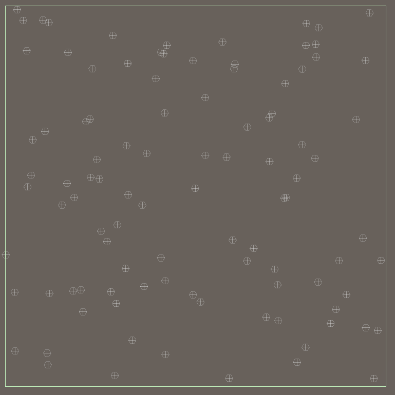
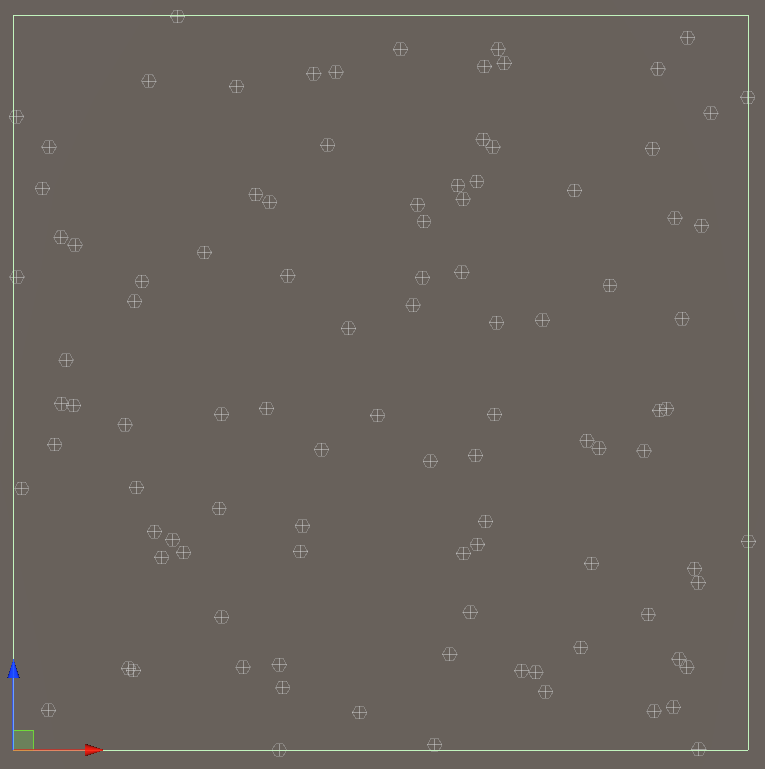
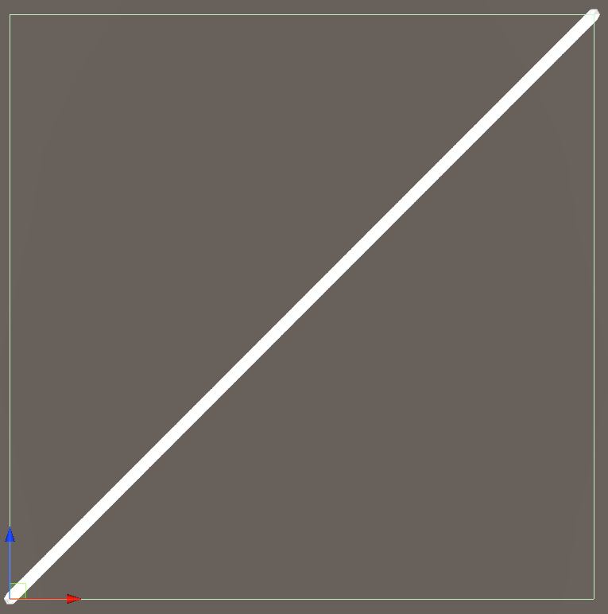
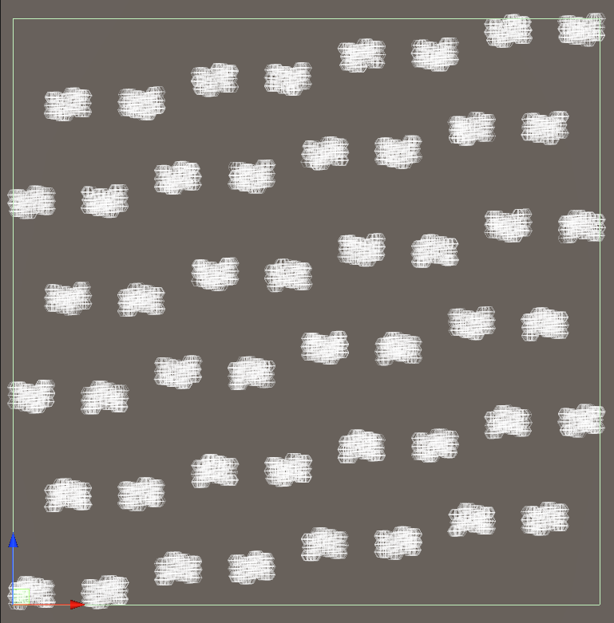
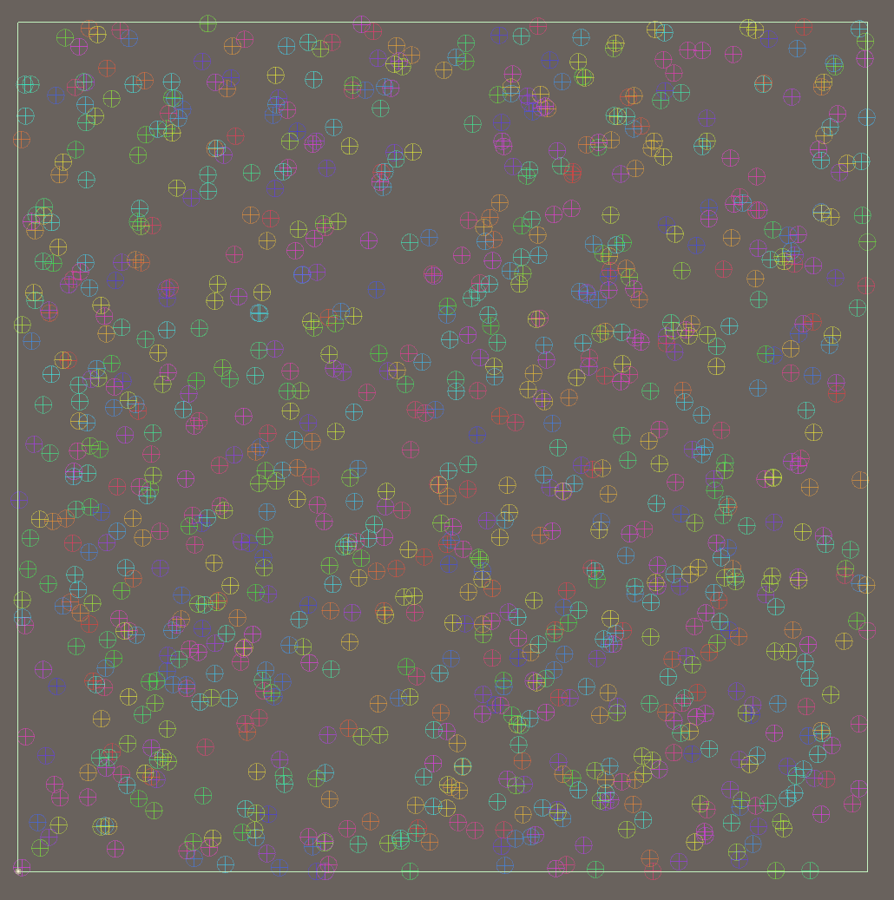

We'll start by generating the random points we'll triangulate later and benchmark that, but first, we need a bit of boilerplate :

- a Monobehaviour holding the generation parameters
- a matching inspector to add a few debug facilities
- a DrawGizmos function to visualize the generated points

## Project and packages setup

Nothing fancy here - a new URP project in Unity 2020.2.1f1 with preview packages enabled, and two extra packages:

- Burst 1.4.6
- Collections 0.15.0-preview.21
- Mathematics 1.2.1

## Monobehaviour and DrawGizmos

The entry point of the entire thing is a MonoBehaviour that will hold all the parameters, and a few more GameObjects for in-editor visualization - a mesh, city labels, etc. The generation could happen at runtime, but to iterate faster, it will be triggered in edit mode from a button in a custom inspector. That inspector will also be used for the many debug options and visualizations we'll add to the process.

Here is the MonoBehaviour:

```csharp
public class MapGenerator : MonoBehaviour
{
    [Header("Parameters")]
    // Generated point count
    public int Count = 100;
    // Size of the generated mesh in world space
    public Vector2Int Size = new Vector2Int(100,100);
    // Random seed
    public int Seed;

    [Header("Data")]
    // Generated points
    private NativeArray<float2> _vertices;

    // Generation entry point
    public void Generate()
    {
        Dispose();
        // written in next section
        _vertices = Generation.GenerateRandomPoints(Count, Size, Seed);
    }

    private void Dispose()
    {
        if(_vertices.IsCreated) _vertices.Dispose();
    }

    private void OnDisable() => Dispose();
    private void OnDestroy() => Dispose();

    private void OnDrawGizmosSelected()
    {
        if (_vertices.IsCreated)
        {
            for (var i = 0; i < _vertices.Length; i++)
            {
                var vertex = _vertices[i];
                Gizmos.DrawWireSphere(new Vector3(vertex.x, 0, vertex.y), 1);
            }
        }
    }
}
```

The parameters should be straight forward. We'll add many more eventually. The data, for now, is just a collection of points: they are of type `float2`, the Unity.Mathematics equivalent of `Vector2`, but optimized for SIMD when Burst-compiled. Burst doesn't support standard C# `float2[]` arrays or `List<>`, it requires a native container allocated in native memory (that's right, `malloc` and no GC). `NativeArray` is the first native container available in core Unity. The `collections` package in the project provides a few more (`NativeList`, `NativeHashMap`, ...). As we'll keep the generated points to vizualize them in the `DrawGizmos` function, that array is allocated using a `Persistent` allocator and needs to be disposed in `Disable`/`Destroy`/before regenerating.

The visualization is trivial for now: just draw a sphere using each point's coordinate on a flat plane.

Not much in the editor for now:

```csharp
[CustomEditor(typeof(MapGenerator))]
public class MapGeneratorEditor : UnityEditor.Editor
{
    public override void OnInspectorGUI()
    {
        if (GUILayout.Button("Generate"))
            ((MapGenerator) target).Generate();
        // Force a gizmo redraw
        SceneView.lastActiveSceneView.Repaint();
        base.OnInspectorGUI();
    }
}
```

## Random point generation

Now some actual procedural generation, even if it's only a few 2d points. We'll allocate a `NativeArray` and run a burst compiled job to generate the vertices (not that the task is so performance-intensive, but mainly to validate everything works as expected). If the generation had to happen at runtime, we'd chain all jobs as much as possible in order to alleviate the pressure on the main thread ; a blocking call will do for now.

```csharp
 public class Generation
{
    public static NativeArray<float2> GenerateRandomPoints(int count, Vector2Int size, int seed, bool withHalton)
    {
        var result = new NativeArray<float2>(count, Allocator.Persistent, NativeArrayOptions.UninitializedMemory);
        float2 fsize = (float2) (Vector2) size;
        new GeneratePointsJob
        {
            Points = result,
            Size = fsize,
            Seed = seed,
        }.Run();
        return result;
    }

    [BurstCompile]
    struct GeneratePointsJob : IJob
    {
        public NativeArray<float2> Points;
        public float2 Size;
        public int Seed;
        public void Execute()
        {
            var rnd = new Random((uint) (Seed));

            for (int index = 0; index < Points.Length; index++)
            {
                Points[index] =
                    rnd.NextFloat2(float2.zero, Size);
            }
        }
    }
}
```

The job is linear, running on a single thread, sequentially assigning a position to each point. The `Random` RNG is the one from `Unity.Mathematics`.

This is the result:



Which is, well, only a bunch of points. With way too much overlap.

We could use a standard [Poisson Sampling](http://theinstructionlimit.com/fast-uniform-poisson-disk-sampling-in-c), or just generate a uniform grid and add some jitter to it, but that's not fun. Instead, let's take that a fantastic opportunity to talk about the Halton Sampler.

## Halton Sampler

Sampling random points is actually a very complicated subject. If you have any doubt, go read the [chapter dedicated to sampling](http://www.pbr-book.org/3ed-2018/Sampling_and_Reconstruction/Sampling_Theory.html) in the PBR Book, the bible of ray tracing and a very detailed and fascinating book by itself. One of the 5 (!!) samplers it details [here](http://www.pbr-book.org/3ed-2018/Sampling_and_Reconstruction/The_Halton_Sampler.html) is a low-discrepancy generator I found very useful in a lot of situations. I won't (and couldn't) go through the maths, so here is a simple version.

```csharp
public static class HaltonSequence
{
    public static double Halton(int index, int nbase)
    {
        double fraction = 1;
        double result = 0;
        while (index > 0)
        {
            fraction /= nbase;
            result += fraction * (index % nbase);
            index = ~~(index / nbase);
        }

        return result;
    }

    // shortcut for later
    public static int HaltonInt(int index, int nbase, int max) => (int) (Halton(index, nbase) * max);
}
```

The `index` parameter should be incremented for each sampled point. You can use it on multiple dimensions while keeping the distribution uniform as long as each dimension call's `nbase` parameter is a prime number:

```csharp
for(int i = 0; i < 100; i++) {
    var f1 = new float4(
        HaltonSequence.Halton(i, 2),
        HaltonSequence.Halton(i, 3),
        HaltonSequence.Halton(i, 5),
        HaltonSequence.Halton(i, 7));
}
```

One of the many use cases I found for that is to produce uniformly distributed colors from sequential indices, e.g., to visualize the items of a collection :

```csharp
public static Color ColorFromIndex(int index, int hbase = 3, float v = 0.5f)
{
    return Color.HSVToRGB((float) HaltonSequence.Halton(index, hbase), 1, v);
}
```

Here's the `GeneratePointsJob` using Halton:

```csharp
[BurstCompile]
struct GeneratePointsHaltonJob : IJobParallelFor
{
    public NativeArray<float2> Points;
    public float2 Size;
    public int Seed;
    public void Execute(int index)
    {
        // use a Random to offset the index in the halton sequence
        var rnd = new Random((uint) (Seed + index)).NextInt(1, Int32.MaxValue);
        // use different primes for each dimenion
        Points[index] = new float2(
            (float) (HaltonSequence.Halton(rnd+index, 2) * Size.x),
            (float) (HaltonSequence.Halton(rnd+index, 3) * Size.y));
    }
}
```

The result, for a low count like that, is not a drastic change, but good enough not to have to relax the points and should avoid a few edge cases of the upcoming Delaunay triangulation.



Now, just to show why you should be careful when picking bases for Halton:



And, as a bonus, let's use the `ColorFromIndex` method described earlier in `DrawGizmosSelected`:

```csharp
for (var i = 0; i < _points.Length; i++)
{
    var vertex = _points[i];
    // v is the HSV brightness
    Gizmos.color = HaltonSequence.ColorFromIndex(i, nbase:3, v:1);
    Gizmos.DrawWireSphere(new Vector3(vertex.x, 0, vertex.y), 1);
}
```



## Performance

Now a few numbers, on average on multiple runs, to get an idea:

```
1000 points, without burst:     0.4ms
1000 points, with burst:        0.2ms
10000 points, without burst:    2.2ms
10000 points, with burst:       0.5ms
100000 points, without burst:  10.5ms
100000 points, with burst:      2.0ms
```

I'll work with around 10k to 15k points on average - Burst is definitely worth it, as we'll see with the [Delaunay triangulation](../../delaunay-triangulation-triangle-storage) that will be presented in the next parts of this series

Code: https://github.com/theor/MapGen-Articles/tree/p1
