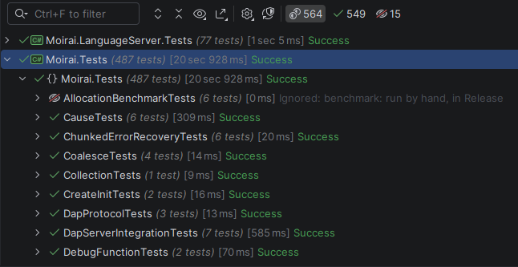
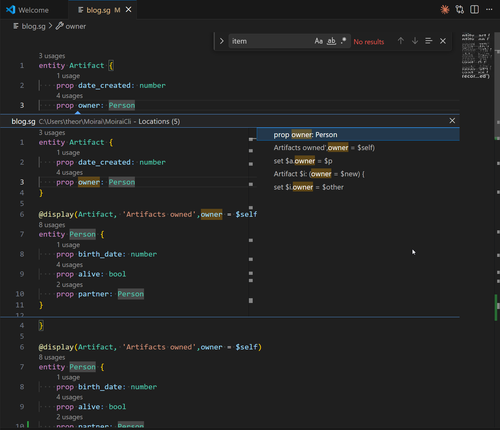
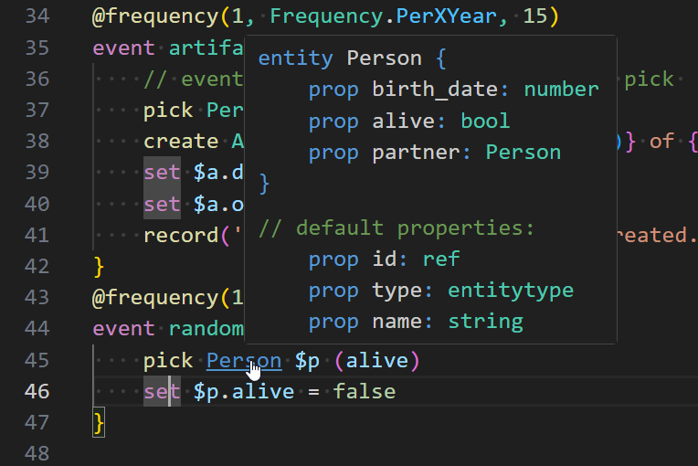
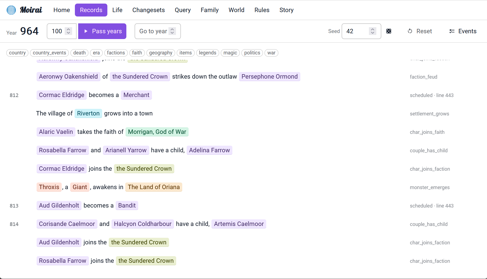
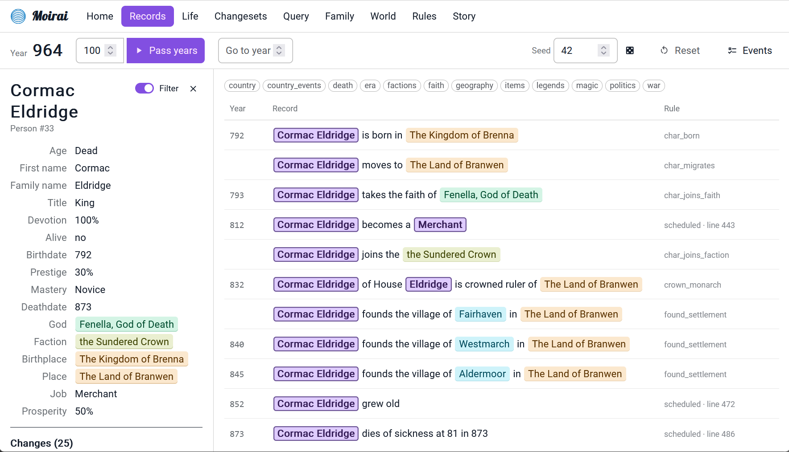
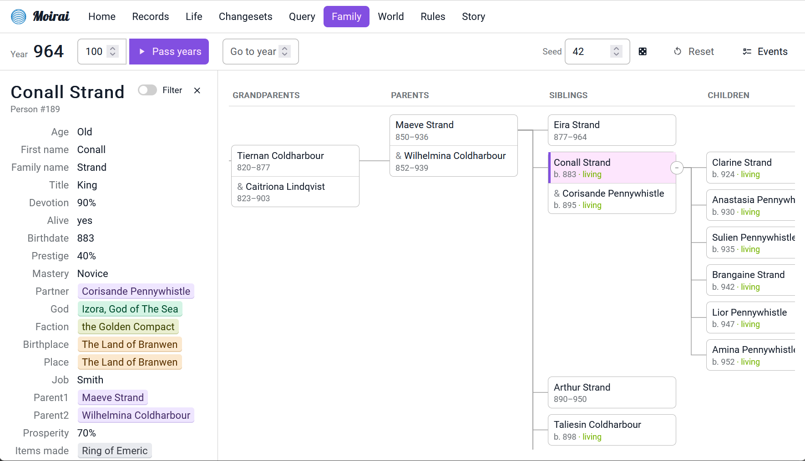
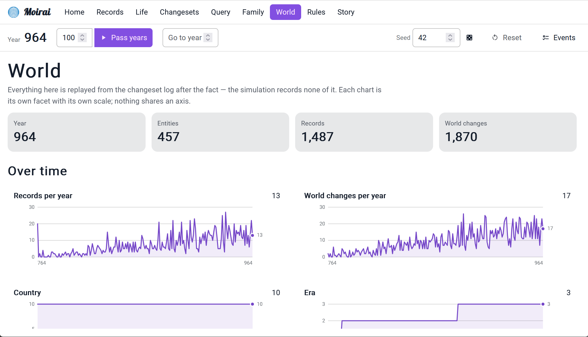
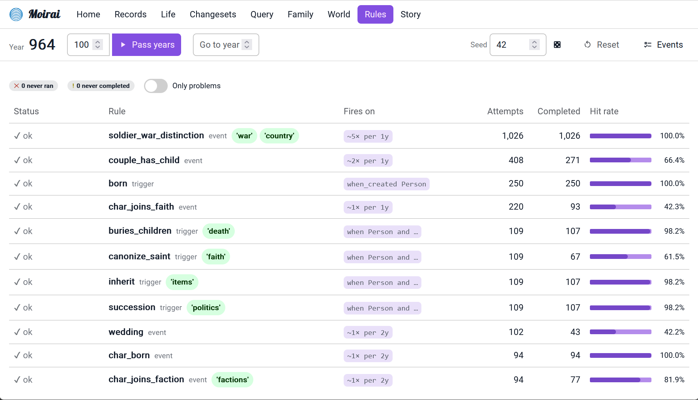
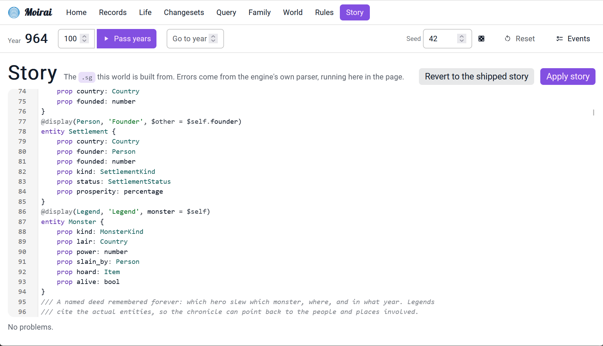

I love procedural generation, and I wanted to generate a world _history_ like Dwarf Fortress does: a timeline of facts, people, events. I ended up with Moirai, a procedural narrative and world-simulation engine driven by a custom language, because every problem is a compiler/interpreter if I try hard enough to solve it.

<Wide>


</Wide>

# What is Moirai?

> A chronological record of significant events (such as those affecting a nation or institution) often including an explanation of their causes
> (Merriam-Webster)

Moirai is a language to describe entities and events happening to them, a runtime to execute the language, a UI to explore the data, and an LSP server for VS Code, all written in C# with minimal dependencies. The UI is a Svelte frontend backed either by an ASP.NET Core API or by a WASM build of the engine, and I intend to test it in Unity too.

If you want to give the WASM build a try, it's hosted on GitHub Pages: [theor.github.io/Moirai/](https://theor.github.io/Moirai/) and the repo with desktop releases is here: [github.com/theor/Moirai](https://github.com/theor/Moirai).


# The language

The language is a mix of Rust, C# and F# - with room for improvement, as the history of the project shows through the syntax.

## A sample world

<Scrollycoding>
## !!steps Entities

Let's start with artifacts. First we need to define the entity, with its properties.

```moirai ! sample.moi
entity Artifact {
    // all entities have an implicit name
    // prop name: string
    prop date_created: number
}
```

## !!steps Events

Then we can declare an event that will happen, on average, once every 15 years. The UI already shows records:


```moirai ! sample.moi
entity Artifact {
    // all entities have an implicit name
    // prop name: string
    prop date_created: number
}

@frequency(1, PerXYear, 15)
event artifact_created() {
    // the parameter is the name, using string interpolation.
    create Artifact $a: 'A{random(1000)}'
    set $a.date_created = #Time.year
    // records are the prose shown in the UI
    record('Artifact {$a.name} has been created')
}
```
## !!steps Random tables
The names are boring; let's add a couple of tables, which can be used to pick random values like you would when playing a TTRPG.

Who doesn't want a Keychain of Destiny?

```moirai ! sample.moi
entity Artifact {
    prop date_created: number
}

    // !focus(1:2)
table NamePrefix { 'Sword', 'Spear', 'Boots', 
                   'Keychain', 'Grimoire'}
table NameSuffix { 'Destiny', 'Doom', 'Solace', 'Joy'}

@frequency(1, PerXYear, 15)
event artifact_created() {
    // !focus(1:1)
    create Artifact $a: '{roll(NamePrefix)} of {roll(NameSuffix)}'
    set $a.date_created = #Time.year
    record('Artifact {$a.name} has been created')
}

```

## !!steps Links between entities

Items need an owner, so let's add people.

```moirai ! sample.moi
entity Artifact {
    prop date_created: number
    prop owner: Person
}
// !focus(1:3)
entity Person {
    prop birth_date: number
}

table NamePrefix { 'Sword', 'Spear', 'Boots', 
                   'Keychain', 'Grimoire'}
table NameSuffix { 'Destiny', 'Doom', 'Solace', 'Joy'}

@frequency(1, PerXYear, 15)
event artifact_created() {
// !focus(1:1)
    pick Person $p
    create Artifact $a: '{roll(NamePrefix)} of {roll(NameSuffix)}'
    // Time is an always present entity. #Time is the syntax to access a singleton
    set $a.date_created = #Time.year
    
// !focus(1:2)
    set $a.owner = $p
    record('Artifact {$a.name} has been created. {$p.name} owns it.')
}

```

## !!steps Creating people

Because no person exists and the `pick` call is unconditional, the event will exit early. `pick`s can be made conditional by putting them in an `if`: `if(pick Person $p) { ... }`

Let's create a few people at startup, using the `@start` attribute on an event:

``` moirai ! sample.moi
entity Artifact {
    prop date_created: number
    prop owner: Person
}
entity Person {
    prop birth_date: number
}

table NamePrefix { 'Sword', 'Spear', 'Boots', 
                   'Keychain', 'Grimoire'}
table NameSuffix { 'Destiny', 'Doom', 'Solace', 'Joy'}

@frequency(1, PerXYear, 15)
event artifact_created() {
    pick Person $p
    create Artifact $a: '{roll(NamePrefix)} of {roll(NameSuffix)}'
    // Time is an always present entity. #Time is the syntax to access a singleton
    set $a.date_created = #Time.year
    
    set $a.owner = $p
    record('Artifact {$a.name} has been created. {$p.name} owns it.')
}

table Names { 'Arwen', 'Brenna', 'Chandra', 'Dorian', 'Evangelique'}
table Surnames { 'Ambervale', 'Brackenridge', 'Corvane', 'Darkmoor', 'Emberlane'}

function create_person(){
    create Person $p: ('{roll(Names)} {roll(Surnames)}')
    record('{$p.name} is born')
}

@start
event populate_world() {
    // repeat a function call
    call(create_person, 10)
}
```

## !!steps Display queries
We can add a `display` attribute to show the result of specific queries in the UI, here all items owned by someone:

```moirai ! sample.moi
entity Artifact {
    prop date_created: number
// !focus
    prop owner: Person
}
// !focus
@display(Artifact, 'Artifacts owned', owner = $self)
entity Person { ... }
```


## !!steps On created trigger

In addition to events, which happen randomly, you can also declare triggers, which react to changes.
We can refactor the birth record into a trigger that runs when a `Person` is created, and also set a flag `alive` to `true`:


```moirai ! sample.moi
entity Person {
    prop birth_date: number
    // !focus
    prop alive: bool
}

function create_person(){
    create Person $p: ('{roll(Names)} {roll(Surnames)}')
            // !diff -
    record('{$p.name} is born')
}

@start
event populate_world() {
    call(create_person, 10)
}

            // !diff(start) +
// !focus(1:6)
trigger birth {
    when_created Person
    set $new.birth_date = #Time.year
    set $new.alive = true
    record('{$new.name} is born')
}
            // !diff(end)

```

## !!steps On change trigger

Similarly, a trigger can react to a property change. A new event causes random people to die; a trigger reacts to `alive = false` and records the death.


```moirai ! sample.moi
entity Person {
    prop birth_date: number
    prop alive: bool
}

function create_person(){
    create Person $p: ('{roll(Names)} {roll(Surnames)}')
}

@start
event populate_world() {
    call(create_person, 10)
}

trigger birth {
    when_created Person
    set $new.birth_date = #Time.year
    set $new.alive = true
    record('{$new.name} is born')
}
@frequency(1, PerXYear, 50)
event random_death() {
    pick Person $p: (alive)
    set $p.alive = false
}

            // !diff(start) +
trigger death {
    when Person and alive = false
    record('{$new.name} leaves this world')
}
            // !diff(end)
```

## !!steps A trigger to give the deceased items away

Building on the previous example, when a person dies, we can iterate over their items to give them to someone else.


```moirai ! sample.moi
entity Person {
    prop birth_date: number
    prop alive: bool
}

function create_person(){
    create Person $p: ('{roll(Names)} {roll(Surnames)}')
}

@start
event populate_world() {
    call(create_person, 10)
}

trigger birth {
    when_created Person
    set $new.birth_date = #Time.year
    set $new.alive = true
    record('{$new.name} is born')
}
@frequency(1, PerXYear, 50)
event random_death() {
    pick Person $p: (alive)
    set $p.alive = false
}

trigger death {
    when Person and alive = false
    record('{$new.name} leaves this world')
// !diff(start) +
    each Artifact $i: (owner = $new) {
        pick Person $other: $other != $new
        set $i.owner = $other
        record('The {$i.name} is given to {$other.name}')
    }
// !diff(end)
}
```

</Scrollycoding>

# On storytelling and morality

I quickly encountered two issues: it takes a _lot_ of rules to model a world worth narrating, and encoding morality in those rules is _hard_. Here is an example with weddings.

<Scrollycoding>
## !!steps First definition
Initially, I started with something naive:
```moirai !
event wedding {
    pick Person $x
    pick Person $y
    set $x.partner = $y
    set $y.partner = $x
    record('{$x.name} and {$y.name} get married')
}
```

## !!steps First problems

<Records>
`032` **Evangelique Emberlane** and **Evangelique Emberlane** get married

`945` **Brenna Brackenridge** and **Chandra Ambervale** get married

`945` **Brenna Brackenridge** and **Dorian Ambervale** get married
</Records>

By failing to define marriage properly, I first encountered narcissism (people marrying themselves, `$x == $y`) and group marriage (`partner != null`: accepted in some cultures, but not the one I was modeling). We can add a couple of checks for that.

```moirai !
event wedding {
    pick Person $x: (partner = null)
    pick Person $y: ($y != $x and partner = null)
    set $x.partner = $y
    set $y.partner = $x
    record('{$x.name} and {$y.name} get married')
}
```

## !!steps Not the time for necromancy
<Records>
`948` **Chandra Ambervale** dies in an accident

`950` **Brenna Brackenridge** and **Chandra Ambervale** get married
</Records>

Maybe we need people to be alive to get married. (Astute readers will have noticed the item inheritance trigger above has the same bug: nothing stops `$other` from being dead.)


```moirai !
event wedding {
    pick Person $x: (alive and partner = null)
    pick Person $y: ($y != $x and alive and partner = null)
    set $x.partner = $y
    set $y.partner = $x
    record('{$x.name} and {$y.name} get married')
}
```

## !!steps Age check
<Records>
`948` **Chandra Ambervale** is born

`958` **Brenna Brackenridge** and **Chandra Ambervale** get married
</Records>

Yuck.


```moirai !
event wedding {
    pick Person $x: (alive and partner = null and age > Age.Child)
    pick Person $y: ($y != $x and alive and partner = null and age > Age.Child)
    set $x.partner = $y
    set $y.partner = $x
    record('{$x.name} and {$y.name} get married')
}
```

## !!steps What's a tree anyway?

<Records>
`745` **Chandra Ambervale** has a child, **Brenna Brackenridge**

`775` **Chandra Ambervale** and **Brenna Brackenridge** get married
</Records>
I first added a `$y != $x.parent1 and $y != $x.parent2`, then `$x.parent1 != $y.parent1 ...`, then wondered: what are the formal definitions of consanguinity, both legally and in terms of graph theory?

The common name for this metric is "degree of kinship". In terms of graphs, if individuals are vertices and parent-child relationships are edges, it's the length of the shortest path between two vertices going through a common ancestor. In civil law, the Roman method of counting kinship is used: find the closest common ancestor, count the generations from each individual up to that ancestor, and sum both counts.

I added a built-in function for that. With the Roman count, a parent is at degree 1, a sibling or grandparent at 2, an aunt or uncle at 3, a first cousin at 4, so `related($x, $y, 6)` rules out everyone up to second cousins:
```moirai
related($a, $b, n)  ⇔  there is a common ancestor X with
                        depth(a → X) + depth(b → X) ≤ n
```

```moirai !
event wedding {
    pick Person $x: (alive and partner = null and age > Age.Child)
    pick Person $y: ($y != $x and alive and partner = null and age > Age.Child and not(related($x, $y, 6)))
    set $x.partner = $y
    set $y.partner = $x
    record('{$x.name} and {$y.name} get married')
}
```
</Scrollycoding>

So, yeah. There's actually research on the topic, see [Ethical formalism](https://en.wikipedia.org/wiki/Ethical_formalism) and [Formal ethics](https://en.wikipedia.org/wiki/Formal_ethics). 

# Runtime

The core of the engine is the `Database`, which contains the various type definitions, entities, tables, events, triggers. It's also the execution entry point. The RNG is seeded, to make runs deterministic. 

## Data and types

All definitions (types, properties, enums) have strongly typed IDs, like this one:

```csharp
public readonly struct EntityTypeId : IEquatable<EntityTypeId>
{
    public static readonly EntityTypeId Null = new EntityTypeId(0);
    public readonly uint Id;
    public EntityTypeId(uint id) => Id = id;
    public bool IsValid => Id != 0;
}

```

They are all readonly structs wrapping uints. IDs start at 1: structs are easy to mis-initialize, so using `default(T)` as an invalid sentinel value makes debugging easier in my experience. When using IDs to index a 0-based C# array, I usually either add an empty value at index 0 or implement a custom indexer handling the -1/+1 offset.

Values are stored as either a reference to a string, an int or a float; everything else is type safety on top of it.

Value types are a pair of an enum and an optional index for references:
```csharp
public readonly struct ValueType : IEquatable<ValueType>
{
    public readonly ValueBaseType BaseType;
    public readonly ushort Index;
}

public enum ValueBaseType : byte
{
    None,
    String,
    Ref, // Index used as EntityId
    Number,
    Float,
    Bool,
    Enum, // Index used as Enum value
    EnumType, // Index used as EnumDefinitionId
    EntityType, // Index used as EntityTypeId
    Percentage
}
```

Entities are typed, and their properties are eagerly allocated - any entity of type T with P properties has a value array of length P. I did try sparse properties, but the memory gain was not worth the compute cost.

### Querying

I initially used SQLite - fantastic piece of software, but given the comparatively small queries I'm doing and the fact that all the data can fit in memory easily, I eventually replaced it with a custom implementation.

{/* ```sql
-- 
CREATE TABLE "entity" (
    "default__id"	INTEGER,
    "default__type"	INTEGER NOT NULL,
    "default__name"	TEXT,
    "Time__year"	INTEGER DEFAULT 0,
    "Person__age"	INTEGER DEFAULT 0,
    "Person__first_name"	TEXT,
    "Person__alive"	INTEGER DEFAULT 0,
    "Person__birthdate"	INTEGER DEFAULT 0,
    "Item__maker"	INTEGER DEFAULT 0,
    "Item__item_type"	INTEGER DEFAULT 0,
    PRIMARY KEY("default__id")
);
``` */}

Most of my queries start with a type filter, so entities are indexed by type id. Boolean properties are indexed too, as `alive` was the bottleneck in my test world for a long time.


## Events

The database also has a list of events (and triggers, see below), which both contain a list of instructions. They implement a `PropertyValue Compute(ExecuteContext ctx)` method - literals, expressions, function calls, if and match statements etc. This is a classic AST evaluator - I did consider converting it to some kind of bytecode, but as querying the database takes way longer than the base instruction execution, it went down the priority list.

Events can start in four ways: by being called explicitly, by being scheduled from another event, when resetting the database if they have a `@start` attribute, or when they are drawn randomly according to their `@frequency(X, mode, Y)` attribute, which comes in two modes.

### EveryXYear: a fixed count, random timing

`@frequency(3, EveryXYear, 10)` means exactly 3 runs in every 10-year window. 
- When Y = 1: the event runs exactly X times every year and draws no random numbers. `@frequency(1, EveryXYear, 1)` is the usual "every year" tick.
- When Y > 1: at the start of each window, the engine picks a random year inside the window for each of the X runs.
  - Each pick is made separately, so two runs can land in the same year.
  - The first window starts at the first year the scheduler checks, not at year 0.
- Nothing is lost: if a year is skipped, any runs due by then happen at the next check.

### PerXYear: an average rate

`@frequency(1, PerXYear, 5)` means on average 1 run every 5 years. 
- Each year, the number of runs is drawn at random with an average of X / Y (a Poisson draw).
- A year can have 0, 1 or several runs. `@frequency(4, PerXYear, 1)` averages 4 a year but varies.
- There is no window, so gaps and bursts happen. Over a long run the average matches X / Y, but there is no fixed count.

## Records and changesets

The database keeps two separate logs: records and changesets. Records are the story, the prose you write:
```moirai
event create_artifact() {
    record('Artifact {$a.name} has been created. {$p.name} owns it.')
}
```

Records have an optional weight (to filter important events), a year, a list of entity ids to follow references, optional tags for UI filtering and a source action. They're also linked to changesets.

Changesets are the database's ledger. Running an event opens a changeset, and every property `set` and entity `create` is added to it. Each change is stored as a delta. Changesets are what drive triggers.

## Triggers

Triggers are run automatically _in reaction to_ created or changed entities. They expose two variables: `$old` if it's a change, `$new` in both cases. The `when` clause at the beginning is used to exit irrelevant triggers early.

```moirai
trigger inherit {
    when Person and alive = false and $old.alive
    // ...
}
```

### Scheduling

A past bottleneck in my test world was checking each year if people grew up. I use an `Age` enum where each value represents a 20-year slice of life. Initially it looked something like this:

```moirai
enum Age { Child, Young, Adult, Old, Dead }
enum Job { Smith, Merchant, Monk }

entity Person {
    prop age: Age
    prop birthdate: number
    /* ...  */
}
@frequency(1, EveryXYear, 1)
event people_grow {
    each Person $p: (alive and age = Age.Child and (birthdate + 20) <= #Time.year) {
        set $p.age = Age.Young
        random_weighted 25 {
            5 => set $p.job = Job.Smith
            10 => set $p.job = Job.Merchant
            10 => set $p.job = Job.Monk
            // ...
        }
    }
    each Person $p: (alive and age = Age.Young and (birthdate + 40) <= #Time.year) {
        set $p.age = Age.Adult
    }
    // ...
}
```
It means that every year, we query every person at least once. This is one of the reasons I indexed boolean properties. It could be refactored to iterate over every person only once, or to run once every 5 or 10 years if aging doesn't have to be exact.

I then realized this would work better event-driven instead of polled. A person's age transitions are known the instant they're born, so each one can be scheduled at its exact future year, instead of re-scanning the whole population every year. Inside a `schedule` block, `$self` is the entity it was scheduled on, and `if $self.alive` skips anyone who died before the transition came due:

```moirai
trigger born {
    when_created Person
    set $new.birthdate = #Time.year
    schedule($new, $new.birthdate + 20) {
        if $self.alive {
            set $self.age = Age.Young
            random_weighted 25 {
                5 => set $self.job = Job.Smith
                10 => set $self.job = Job.Merchant
                10 => set $self.job = Job.Monk
            }
        }
    }
    // ...
}
```

# Testing

On top of standard arrange-act-assert tests, the parser tests pretty-print the parsed code and check that the parse/print round trip is idempotent.

Engine tests use stories written inline or fixture files.



# Profiling and performance

Once the world is warmed up, simulating a year doesn't allocate anything besides the storage the world keeps growing. That storage grows in chunks: `ChunkedList<T>` (1024 items per chunk) and `Slab<T>` (~64 KB arrays), and strings can live in a `Slab<char>`. The `BytesPerYear` test tracks this: the median year of `w.sg`, my main test world (stories use either the `.sg` or `.moi` extension), allocates 0 bytes. 1000 years of it allocate 17.8 MB in total, with about 6 ms of GC pause and 21 MB still live afterwards.

To find what's slow, the `--profile` flag prints a table after each simulation pass, with a row per event and per trigger: invocations, hit rate, self and inclusive time, and allocated KB.

Rule coverage counters are always on, profiler or not. The Rules page of the UI uses them to flag rules that never ran and rules that never completed, which usually means a `pick` that never matches.

# Parsing and LSP

The parser lives in a separate DLL: the plan was to allow ahead-of-time parsing to some serializable format that could be run by the engine DLL, but I never got there.

I initially used ANTLR. Its grammar is great, but the build pipeline is not my favorite, especially with Java in the mix. I then migrated to [Superpower](https://github.com/datalust/superpower), a really nice C# parser combinator library.

There is a separate parsing entry point for the LSP server, which keeps references to the source tokens in the parsed AST. That way, the LSP can locate error squiggles and symbol definitions correctly.




# Hosts

The main UI is a Svelte SPA, which can either hit an ASP.NET Core API exposing an engine instance or a WASM build of the engine.
It shows the record and changeset feeds, can filter by entity, show an entity's properties and history, run DB queries, draw a family tree, and more.

The records feed, filterable by tag:



Selecting an entity shows its properties next to its own history:



The family tree:



World statistics, replayed from the changeset log:



Rule coverage, to spot events and triggers that never fire:



The WASM build also embeds a story editor for demo purposes:



I should get around to writing a Unity host...

# Conclusion

I hope this was a fun read. I don't know if this will ever be useful to someone else, but I will definitely use it next time I run a TTRPG.

Next on the list: the Unity host, maybe a bytecode interpreter if queries ever stop being the bottleneck, and a lot more rules, because a world only gets interesting once enough of them start interacting. If you try the [WASM build](https://theor.github.io/Moirai/) and write a story of your own, I'd love to see what comes out of it. Until then!


