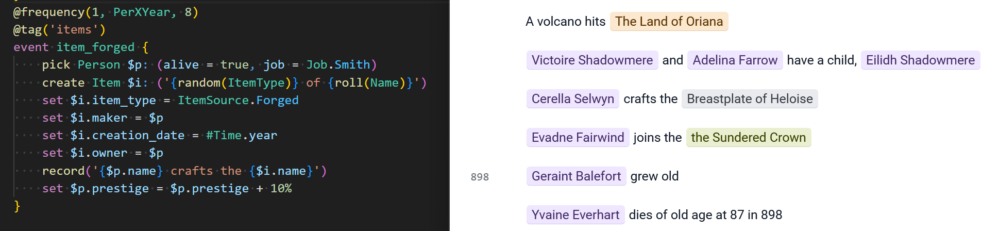
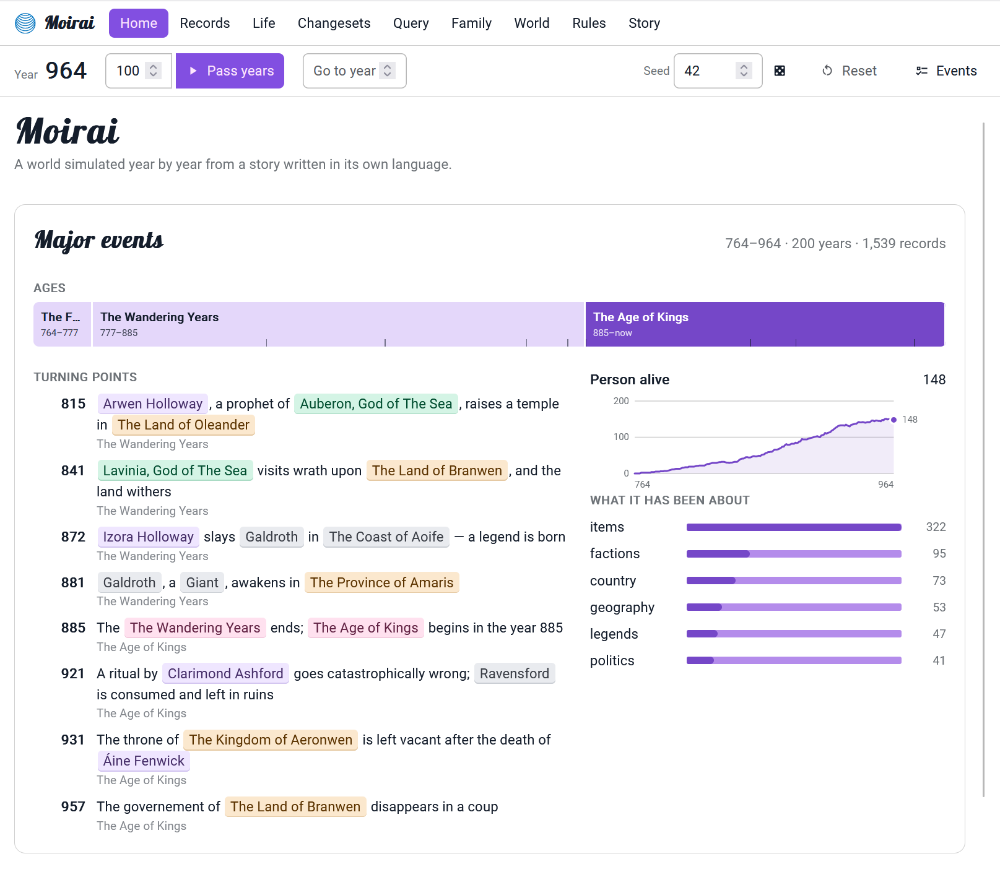
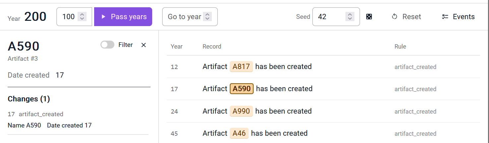
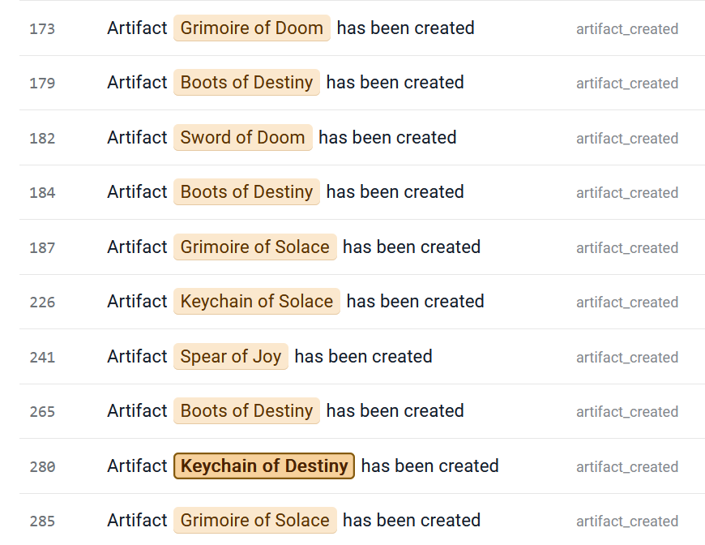
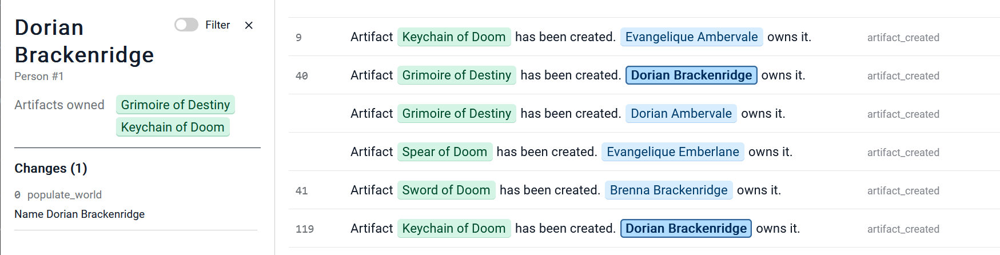
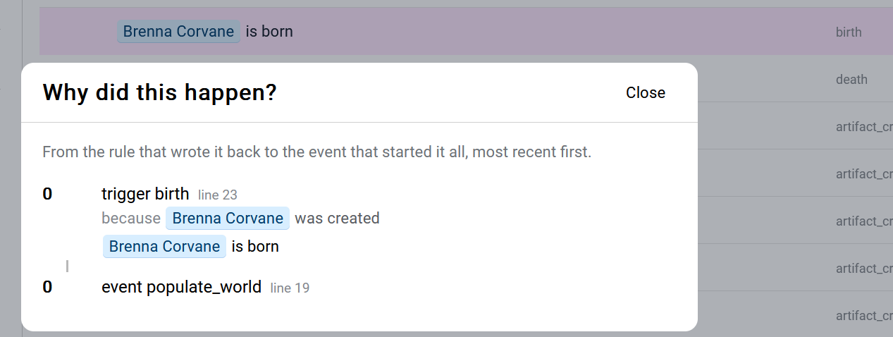
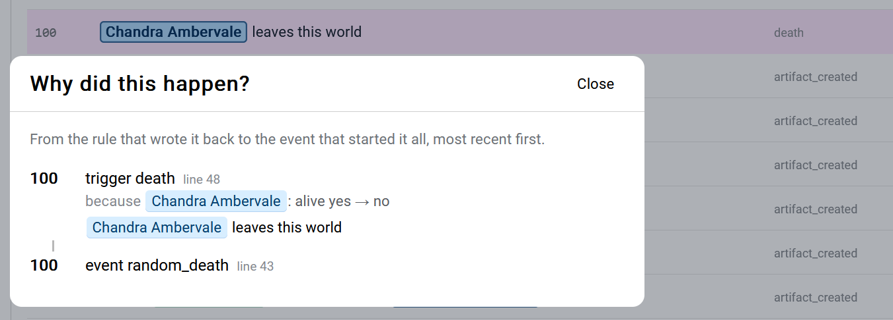
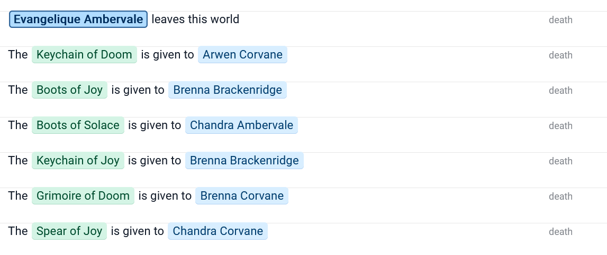

I love procedural generation, and I wanted to generate a world _history_ like Dwarf Fortress does: a timeline of facts, people, events. I ended up with Moirai, a procedural narrative and world-simulation engine driven by a custom language, because every problem is a compiler/interpreter if I try hard enough to solve it.



# What's history ? A sample

> A chronological record of significant events (such as those affecting a nation or institution) often including an explanation of their causes
> (Merriam-Webster)

Moirai is a language to describe entities and events happening to them, a runtime to execute the language, a UI to explore the data, and a VS Code LSP.
 If you want to give a try to the WASM build, it's hosted as a github pages site: [theor.github.io/Moirai/](https://theor.github.io/Moirai/).




# The language

The language has a taste of ECMAScript with a sprinkle of rust and F# in my opinion.

<Scrollycoding>
## !!steps Entities

Let's start with artifacts. First we need to define the entity, with its properties.

```moirai ! sample.moi
entity Artifact {
    // all entities have an implicit name
    // prop name: string
    prop date_created: number
}
```

## !!steps Events

Then we can declare an event, that will happen randomly every 15 years. The UI will already show records


```moirai ! sample.moi
entity Artifact {
    // all entities have an implicit name
    // prop name: string
    prop date_created: number
}

@frequency(1, Frequency.PerXYear, 15)
event artifact_created() {
    // the parameter is the name, using string interpolation.
    create Artifact $a: 'A{random(1000)}'
    set $a.date_created = #Time.year
    // records are the prose shown in the UI
    record('Artifact {$a.name} has been created')
}
```
## !!steps Random tables
The names are boring ; let's add a couple of tables, which can be used to picked random values like you would when playing a TTRPG.

Who doesn't want a Keychain of Destiny ?

```moirai ! sample.moi
entity Artifact {
    prop date_created: number
}

    // !focus(1:2)
table NamePrefix { 'Sword', 'Spear', 'Boots', 
                   'Keychain', 'Grimoire'}
table NameSuffix { 'Destiny', 'Doom', 'Solace', 'Joy'}

@frequency(1, Frequency.PerXYear, 15)
event artifact_created() {
    // !focus(1:1)
    create Artifact $a: '{roll(NamePrefix)} of {roll(NameSuffix)}'
    set $a.date_created = #Time.year
    record('Artifact {$a.name} has been created')
}

```

## !!steps Links between entities

Items need an owner, so let's add people.

```moirai ! sample.moi
entity Artifact {
    prop date_created: number
    prop owner: Person
}
// !focus(1:3)
entity Person {
    prop birth_date: number
}

table NamePrefix { 'Sword', 'Spear', 'Boots', 
                   'Keychain', 'Grimoire'}
table NameSuffix { 'Destiny', 'Doom', 'Solace', 'Joy'}

@frequency(1, Frequency.PerXYear, 15)
event artifact_created() {
// !focus(1:1)
    pick Person $p
    create Artifact $a: '{roll(NamePrefix)} of {roll(NameSuffix)}'
    // Time is an always present entity. #Time is the syntax to access a singleton
    set $a.date_created = #Time.year
    
// !focus(1:2)
    set $a.owner = $p
    record('Artifact {$a.name} has been created. {$p} owns it.')
}

```

## !!steps Creating people

Because no person exists and the `pick` call is unconditional, the event will exit early. `pick`s can be made conditional by putting them in an `if`: `if(pick Person $p) { ... }`

Let's create a few people at startup, using the @start attribute on an event:

``` moirai ! sample.moi
entity Artifact {
    prop date_created: number
    prop owner: Person
}
entity Person {
    prop birth_date: number
}

table NamePrefix { 'Sword', 'Spear', 'Boots', 
                   'Keychain', 'Grimoire'}
table NameSuffix { 'Destiny', 'Doom', 'Solace', 'Joy'}

@frequency(1, Frequency.PerXYear, 15)
event artifact_created() {
    pick Person $p
    create Artifact $a: '{roll(NamePrefix)} of {roll(NameSuffix)}'
    // Time is an always present entity. #Time is the syntax to access a singleton
    set $a.date_created = #Time.year
    
    set $a.owner = $p
    record('Artifact {$a.name} has been created. {$p} owns it.')
}

table Names { 'Arwen', 'Brenna', 'Chandra', 'Dorian', 'Evangelique'}
table Surnames { 'Ambervale', 'Brackenridge', 'Corvane', 'Darkmoor', 'Emberlane'}

function create_person(){
    create Person $p: ('{roll(Names)} {roll(Surnames)}')
    record('{$p.name} is born')
}

@start
event populate_world() {
    // repeat a function call
    call(create_person, 10)
}
```

## !!steps Display queries
We can add a `display` attribute to show the result of specific queries in the UI, here all items owned by someone:

```moirai ! sample.moi
entity Artifact {
    prop date_created: number
// !focus
    prop owner: Person
}
// !focus
@display(Artifact, 'Artifacts owned',owner = $self)
entity Person { ... }
```


## !!steps On created trigger

In addition to events, which happen randomly, you can also declare triggers, which react to changes.
We can refactor the birth record as a trigger run when a `Person` is created, and also set a flag `alive` to `true`:



```moirai ! sample.moi
entity Person {
    prop birth_date: number
    // !focus
    prop alive: bool
}

function create_person(){
    //!focus
    create Person $p: ('{roll(Names)} {roll(Surnames)}')
}

@start
event populate_world() {
    call(create_person, 10)
            // !diff -
    record('{$p.name} is born')
}

            // !diff(start) +
// !focus(1:6)
trigger birth {
    when_created Person
    set $new.birth_date = #Time.year
    set $new.alive = true
    record('{$new.name} is born')
}
            // !diff(end)

```

## !!steps On change trigger

Similarly, a trigger can react to a property change. A new event causes random persons to die ; a trigger reacts to `alive = false` and records the death.



```moirai ! sample.moi
entity Person {
    prop birth_date: number
    prop alive: bool
}

function create_person(){
    create Person $p: ('{roll(Names)} {roll(Surnames)}')
}

@start
event populate_world() {
    call(create_person, 10)
    record('{$p.name} is born')
}

trigger birth {
    when_created Person
    set $new.birth_date = #Time.year
    set $new.alive = true
    record('{$new.name} is born')
}
@frequency(1, Frequency.PerXYear, 50)
event random_death() {
    pick Person $p (alive)
    set $p.alive = false
}

            // !diff(start) +
trigger death {
    when Person and alive = false
    record ('{$new.name} leaves this world')
}
            // !diff(end)
```

## !!steps A trigger to give the deceased items away

Building on the previous example, when a person dies, we can iterate on its owned items to give them to someone else.



```moirai ! sample.moi
entity Person {
    prop birth_date: number
    prop alive: bool
}

function create_person(){
    create Person $p: ('{roll(Names)} {roll(Surnames)}')
}

@start
event populate_world() {
    call(create_person, 10)
    record('{$p.name} is born')
}

trigger birth {
    when_created Person
    set $new.birth_date = #Time.year
    set $new.alive = true
    record('{$new.name} is born')
}
@frequency(1, Frequency.PerXYear, 50)
event random_death() {
    pick Person $p (alive)
    set $p.alive = false
}

trigger death {
    when Person and alive = false
    record ('{$new.name} leaves this world')
// !diff(start) +
    each Artifact $i: (owner = $new) {
        pick Person $other: $other != $new
        set $i.owner = $other
        record('The {$i.name} is given to {$other.name}')
    }
// !diff(end)
}
```

</Scrollycoding>

# On storytelling and morality

I quickly encountered two issues: it takes a _lot_ of rules to model a world worth narrating, and encoding  a morality in those rules is _hard_. Here is an example with weddings.

<Scrollycoding>
## !!steps First definition
Initially, I started with something naive:
```moirai !
event wedding {
    pick Person $x
    pick Person $y
    set $x.partner = $y
    set $y.partner = $x
    record '{$x.name} and {$y.name} get married'
}
```

## !!steps First problems

> 032: Evangelique Emberlane and Evangelique Emberlane get married

> 945: Brenna Brackenridge and Chandra Ambervale get married

> 945: Brenna Brackenridge and Dorian Ambervale get married

By failing to define marriage properly, I first encountered narcissicm (people marrying themselves, `$x == $y`) and group mariage (`partner != null`. Accepted in some cultures, not the one I was modeling). We can add a couple of checks for that.

```moirai !
event wedding {
    pick Person $x: (partner = null)
    pick Person $y: ($y != $x and partner = null)
    set $x.partner = $y
    set $y.partner = $x
    record '{$x.name} and {$y.name} get married'
}
```

## !!steps Not the time for necromancy
> 948: Chandra Ambervale dies in an accident

> 950: Brenna Brackenridge and Chandra Ambervale get married

Maybe we need people to be alive to get married.


```moirai !
event wedding {
    pick Person $x: (alive and partner = null)
    pick Person $y: ($y != $x and alive and partner = null)
    set $x.partner = $y
    set $y.partner = $x
    record '{$x.name} and {$y.name} get married'
}
```

## !!steps Age check
> 948: Chandra Ambervale is born

> 958: Brenna Brackenridge and Chandra Ambervale get married

Yuck.


```moirai !
event wedding {
    pick Person $x: (alive and partner = null and age > Age.Child)
    pick Person $y: ($y != $x and alive and partner = null and age > Age.Child)
    set $x.partner = $y
    set $y.partner = $x
    record '{$x.name} and {$y.name} get married'
}
```

## !!steps What's a tree anyway ?

> 745: Chandra Ambervale has a child, Brenna Brackenridge

> 775: Chandra Ambervale and Brenna Brackenridge get married

I first added a `$y != $x.parent1 and $y != $x.parent2`, then `$x.parent1 != $y.parent1 ...`, then wondered: what are the formal definitions of consanguinity, both legally and in terms of graph theory ?

The common name for this metric is "degree of kinship". In terms of graphs, it's the shortest path from one vertex (individual) to another. In civil-law, the Roman way of counting kinship is used: find an ancestor they share, count the generations from each individual to their shared ancestor, sum that.

I added a built-in function for that:
```moirai
related($a, $b, n)  ⇔  there is a common ancestor X with
                        depth(a → X) + depth(b → X) ≤ n
```

```moirai !
event wedding {
    pick Person $x: (alive and partner = null and age > Age.Child)
    pick Person $y: ($y != $x and alive and partner = null and age > Age.Child and not(related($x, $y, 6)))
    set $x.partner = $y
    set $y.partner = $x
    record '{$x.name} and {$y.name} get married'
}
```
</Scrollycoding>

So, yeah. There's actually research on the topic, see [Ethical formalism](https://en.wikipedia.org/wiki/Ethical_formalism) and [Formal ethics](https://en.wikipedia.org/wiki/Formal_ethics). 

# Runtime

The core of the engine is the `Database`, which contains the various type definitions, entities, tables, events, triggers. It's also the execution entry point. The RNG is seeded, to make runs deterministic. 

## Data and types

All definitions (types, properties, enums) have strongly typed IDs, like this one:

```csharp
public readonly struct EntityTypeId : IEquatable<EntityTypeId>
{
    public static readonly EntityTypeId Null = new EntityTypeId(0);
    public readonly uint Id;
    public EntityTypeId(uint id) => Id = id;
    public bool IsValid => Id != 0;
}

```

They all are readonly structs wrapping uints. Ids start at 1 - structs are easy to mis-initialize, so using `default(T)` as an invalid sentinel value make debugging easier in my experience, and when using ids to index a C# 0-based array, I usually either add an empty value at index 0 in the array or implement a custom indexer handling the -1/+1 offset.

Values are stored as either a reference to a string, an int or a float ; everything else is type safety on top of it.

Value types are a pair of an enum and an optional index for references:
```csharp
public readonly struct ValueType : IEquatable<ValueType>
{
    public readonly ValueBaseType BaseType;
    public readonly ushort Index;
}

public enum ValueBaseType : byte
{
    None,
    String,
    Ref, // Index used as EntityId
    Number,
    Float,
    Bool,
    Enum, // Index used as Enum value
    EnumType, // Index used as EnumDefinitionId
    EntityType, // Index used as EntityTypeId
    Percentage
}
```

Entities are typed, and their properties are eagerly allocated - any entity of type T with P properties has a value array of length P. I did try sparse properties, but the memory gain was not worth the compute cost.

### Querying

I initially used SQLite - fantastic piece of software, but given the comparatively small queries I'm doing and the fact that all the data can fit in memory easily, I eventually replaced it with a custom implementation.

{/* ```sql
-- 
CREATE TABLE "entity" (
	"default__id"	INTEGER,
	"default__type"	INTEGER NOT NULL,
	"default__name"	TEXT,
	"Time__year"	INTEGER DEFAULT 0,
	"Person__age"	INTEGER DEFAULT 0,
	"Person__first_name"	TEXT,
	"Person__alive"	INTEGER DEFAULT 0,
	"Person__birthdate"	INTEGER DEFAULT 0,
	"Item__maker"	INTEGER DEFAULT 0,
	"Item__item_type"	INTEGER DEFAULT 0,
	PRIMARY KEY("default__id")
);
``` */}

Most of my queries start with a type filter, so entities are indexed by type id. Boolean properties are indexed too, as `alive` was the bottleneck in my test world for a long time.


## Events

The database also has a list of events (and triggers, see below), which both contain a list of instructions. They implement a `PropertyValue Compute(ExecuteContext ctx)` method - literals, expressions, function calls, if and match statements etc. This is a classic AST evaluator - I did consider converting it to some kind of bytecode, but as querying the database take way longer than the base instruction execution, it went down the priority list.

Events can start four ways: by being called explicitely or by being scheduled from another event, when resetting the database if they have a `@start` attribute, or when they are drawn randomly according to their `@frequency` tag, which come in two variants.

### EveryXYear: a fixed count, random timing

@frequency(3, EveryXYear, 10) means exactly 3 runs in every 10-year window. 
- When Y = 1: the event runs exactly X times every year and draws no random numbers. @frequency(1, EveryXYear, 1) is the usual "every year" tick.
- When Y > 1: at the start of each window, the engine picks a random year inside the window for each of the X runs.
  - Each pick is made separately, so two runs can land in the same year.
  - The first window starts at the first year the scheduler checks, not at year 0.
- Nothing is lost: if a year is skipped, any runs due by then happen at the next check.

### PerXYear: an average rate

@frequency(1, PerXYear, 5) means on average 1 run every 5 years. 
- Each year, the number of runs is drawn at random with an average of X / Y (a Poisson draw).
- A year can have 0, 1 or several runs. @frequency(4, PerXYear, 1) averages 4 a year but varies.
- There is no window, so gaps and bursts happen. Over a long run the average matches X / Y, but there is no fixed count.

## Records and changesets

The database keeps two separate logs: records are the story, the prose you write.
```moirai
event create_artifact() {
    record('Artifact {$a.name} has been created. {$p.name} owns it.')
}
```

Records have an optional weight (to filter important events), a year, a list of entity ids to follow references, optional tags for UI filtering and a source action. They're also linked to changesets.

Changesets make the ledger of the database. Running an event opens a changeset, and any `set` property or `create` entity is included. Each change is stored as a delta. They drive the triggers.

## Triggers

Triggers are run automatically _in reaction to_ created or changed entities. They expose two variables: `$old` if it's a change, `$new` in both cases. The `when` clause at the beginning is used to early exit irrelevant triggers  

```moirai

trigger inherit {
    when Person and alive = false and $old.alive
    // ...
}
```

### Scheduling

A past bottleneck in my test world was checking each year if people grew up. I use an `Age` enum where each value represents a 20 years slice of life. Initially it looked something like that:

```moirai
enum Age { Child, Young, Adult, Old, Dead }
enum Job { Smith, Merchant, Monk }

entity Person {
    prop age: Age
    prop birthdate: number
    /* ...  */
}
@frequency(1, EveryXYear, 1)
event people_grow {
    each Person $p: (alive = true, age = Age.Child, (birthdate + 20) <= #Time.year){
        set $p.age = Age.Adult
    }
    each Person $p: (alive = true, age = Age.Young, (birthdate + 40) <= #Time.year){
        set $p.age = Age.Adult
        random_weighted 25 {
            5 => set $p.job = Job.Smith
            10 => set $p.job = Job.Merchant
            10 => set $p.job = Job.Monk
            // ...
        }
    }
    // ...
}
```
It means that every year, we query every person at least once. This is one the reason I indexed boolean properties. It can be refactored to iterate once on every person ; it could be run exactly once every 5 or 10 years if people growing up doesn't have to be exact. 

I then realized this would work better event-driven instead of polled, by scheduling effects :

```moirai
trigger born {
    when_created Person
    set $new.birthdate = #Time.year
    // A person's age transitions are known the instant they're born, so schedule each one to fire at its exact future year instead of re-scanning the whole population every year. This replaces the old children_grow / youngs_grow / adults_grow events (each was an `each Person` poll). $self is the person; `if $self.alive` skips anyone who died before the transition came due.
    schedule($new, $new.birthdate + 20) {
        if $self.alive {
            set $self.age = Age.Young
            random_weighted 25 {
                5 => set $p.job = Job.Smith
                10 => set $p.job = Job.Merchant
                10 => set $p.job = Job.Monk
            }
        }
    }
    // ...
}
```

# Testing

- NUnit suites: engine and DSL behaviour, snapshot goldens (tokens, printed Database, 50-year record history), one fixture per grammar rule, error recovery, trigger gating, query narrowing, nested calls, and allocation benchmarks.
- Re-blessing goldens: UPDATE_GOLDENS=1 dotnet test.
- Story sources: Stories.Wsg is only for tests about w.sg itself. Engine tests use stories written inline or fixtures from TestProject1/Stories/.

# Profiling and performance

- A simulated year allocates only storage. Everything the world keeps grows in chunks: ChunkedList\<T\> (1024 items per chunk) and Slab\<T\> (~64 KB arrays). Strings can live in a Slab\<char\>. BytesPerYear measures this: the median year of w.sg allocates 0 bytes.
- 1000 years of w.sg allocate 17.8 MB, with about 6 ms of GC pause and 21 MB live afterwards.
- Profiler: --profile prints a table per event and per trigger for each pass. It shows invocations, hit %, self and inclusive time, and allocated KB.
- Rule coverage counters are always on. The Rules page uses them to flag rules that never ran and rules that never completed.

# Parsing

Parser (Moirai.Parser/)

- It is hand-written: a character-by-character tokenizer with a mode stack for string interpolation, plus Superpower combinators. There is no ANTLR and no code generation.
- StoryParser.Parse splits the token stream at top-level definitions and parses each chunk separately. One broken definition does not blank out the rest of the file.
- ParseForTooling also returns tokens, the AST and the linker, for the LSP.

# Hosts

- WorldSession is the one implementation of the client API: reset, pass years, feed, queries, biography, family tree, chronicle, cause and story editing. It is deliberately not thread-safe; locking is each host's job.
- Server: a SignalR hub that guards one static world with a single semaphore.
- WASM: runs on the page's main thread and breaks passes into adaptive chunks of about 50 ms so the UI stays responsive. The trimmed bundle is about 3.5 MB (1.1 MB brotli).
- Cross-host determinism: seed 42 plus 120 years of w.sg gives the same counts on .NET and on WASM.

# Language server


