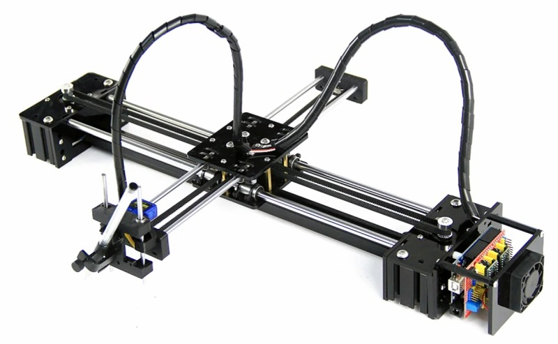

I built a pen plotter and spent a lot of time fine-tuning it - from tweaking an existing design to designing a tangential knife.

# Starting with a cheap kit

I started with a basic kit from AliExpress, sometimes named "LY Drawbot", as I was not sure it was for me. It was a bad choice. Let's have a look at the design and the parts that came with it.

The machine is a T-shaped one like the AxiDraw, a core xy design with steppers on both ends of the X axis, and a Y axis mounted on the gantry. 

Both axis use linear bearings. I don't know how much difference there is between a cheap bearing and an expensive one ; the ones in the kits are noisy, have play and do not produce smooth movement. 

The gantry is a couple of laser cut acrylic plates, with tie wraps to secure the bearings. The play in there leads to the pen height varying a lot then it moves on the Y axis. 

The controller is an arduino cnc shield. 

The pen lift uses a servo. They're noisy and fragile, but cheap and don't require another stepper driver. They're usually mapped to the GCode M3 command, which can be a pain in some software. 
The movement is accomplished with small linear bearings and a rubber band. In my experience smaller *cheap* linear bearings have proportionally even more play.

The pen is secured with a screw pushing it against a bracket. It's...ok, but I realized later that it makes any pen change complicated if the two pens don't have the same diameter.
