import { Image } from 'astro:assets';

export const imgw = 300;

I built a pen plotter and spent a lot of time fine-tuning it - from tweaking an existing design to designing a tangential knife.

<Video src={import("./banner.mp4")} />

# Starting with a cheap kit

I started with a basic kit from AliExpress, sometimes named "LY Drawbot", as I was not sure it was for me. It was a bad choice. Let's have a look at the design and the parts that came with it.

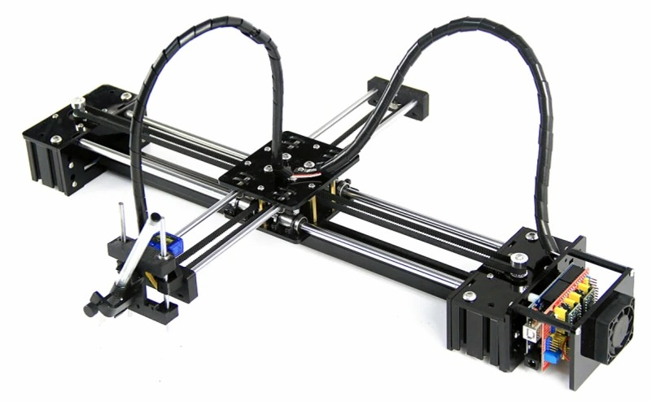

The machine is a T-shaped one like the AxiDraw, a core xy design with steppers on both ends of the X axis, and a Y axis mounted on the gantry. 

Both axis use linear bearings. I don't know how much difference there is between a cheap bearing and an expensive one ; the ones in the kits are noisy, have play and do not produce smooth movement. 

The gantry is a couple of laser cut acrylic plates, with tie wraps to secure the bearings. The play in there leads to the pen height varying a lot then it moves on the Y axis. 

The controller is an arduino cnc shield. GRBL on an old 8-bit MCU is slow but it works. The stepper drivers are a4988, which are noisy.

The kit does not come with end stops: you have to zero the machine by hand.

The pen lift uses a servo. They're noisy and fragile, but cheap and don't require another stepper driver. They're usually mapped to the GCode M3 command, which can be a pain in some software. 
The movement is accomplished with small linear bearings and a rubber band. In my experience smaller *cheap* linear bearings have proportionally even more play.

The pen is secured with a screw pushing it against a bracket. It's...ok, but I realized later that it makes any pen change complicated if the two pens don't have the same diameter.

All in all, it's a reasonable starting kit... but I wanted a quieter, faster, more accurate machine.

# Using a different design

I stumbled upon Lehaiver's CoreXY frame on thingiverse [here](https://www.thingiverse.com/thing:2138286). It's an elegant design:

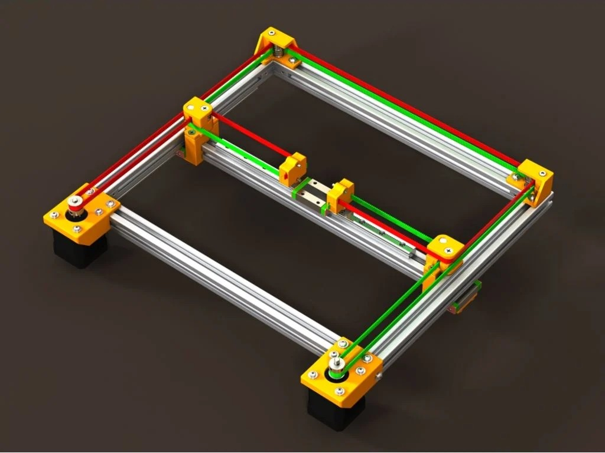

CoreXY kinematics with linear guides on 20mm aluminum extrusions. I ended up redesigning most of the parts in OnShape from scratch, but it's a great starting point. The linear guides are a huge improvement over the linear bearings, and the aluminum extrusions bring a lot of rigidity.

## Feet

- Without feet the frame sits flat on the table: no clearance for the corner brackets, the belt runs or the idlers.
- Printed L-shaped feet: one leg screwed to the extrusion, one leg flat on the board.
- Two countersunk holes in the flat leg, so the whole machine is screwed down to an MDF board.

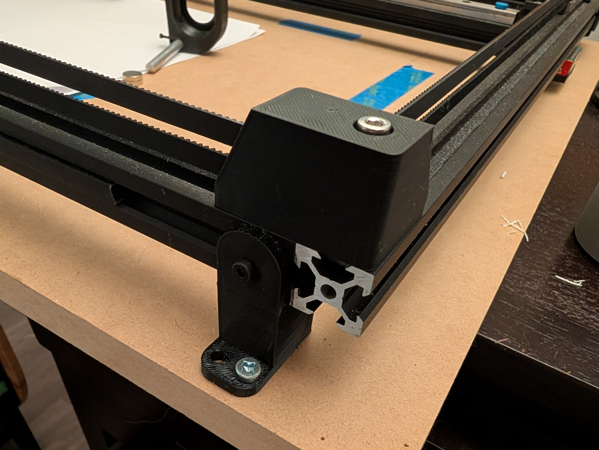

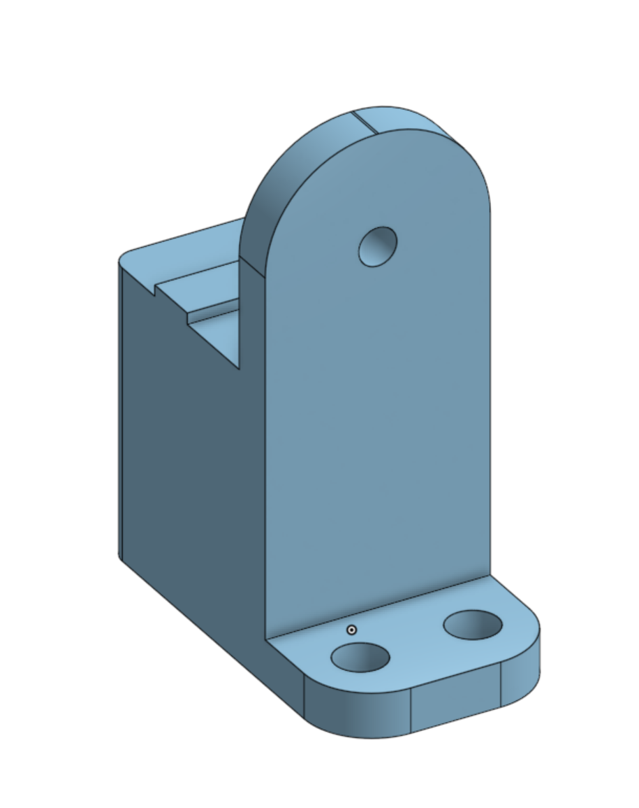

{/* TODO fill in:
- how the vertical leg attaches - slot nut, corner bracket, or the extrusion's end tap?
- how much lift do they give, and why that height - belt clearance, cable pass-through, something else?
- what does screwing the frame to a board actually buy - squareness, moving it around, vibration?
- any levelling adjustment, or is the MDF board the reference surface?
- how many feet, and did the frame need diagonal bracing once it was off the table?
*/}

## Gantry

Lehaiver made a [Laser mount](https://www.thingiverse.com/thing:2685298) with a dove tail plate that I tweaked to fit a pen lift. Belts are easier to tighten on this one.

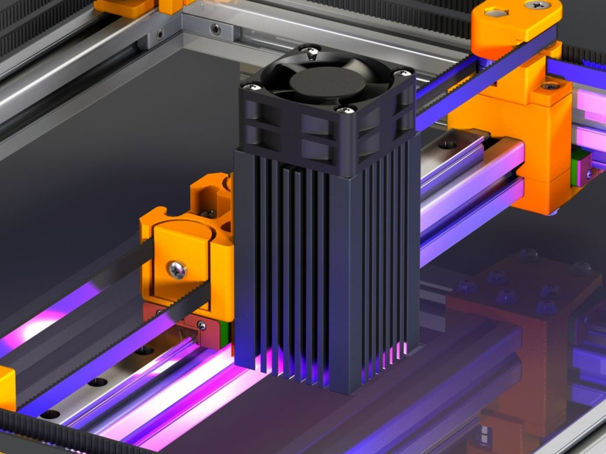

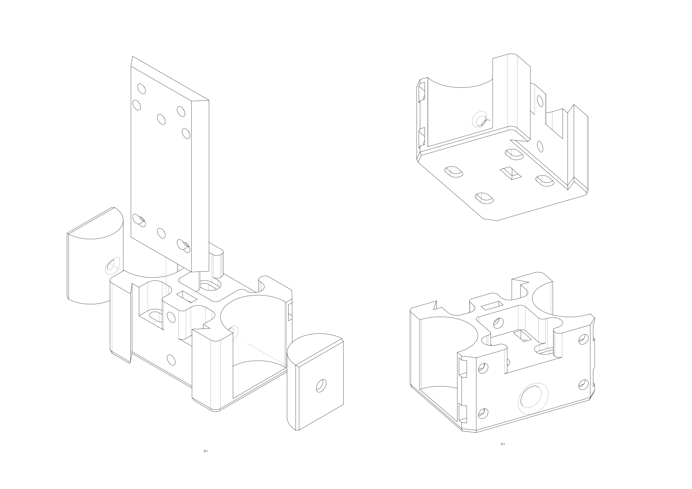

 I also added a couple of captive nuts to fasten a bowden tube for cable management and a limit switch.
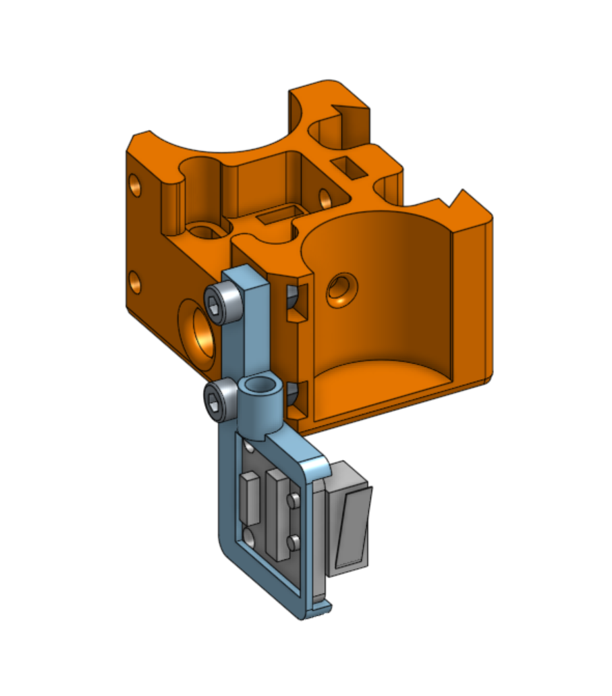

## Limit switches

Speaking of limit switches: I added one on each axis. The Y axis switch is mounted on the gantry with the mount shown above, and the X axis one is mounted on the frame. As it's only a plotter and not a CNC, I'm ok with one switch per axis.

The gantry switch hits the X axis end.

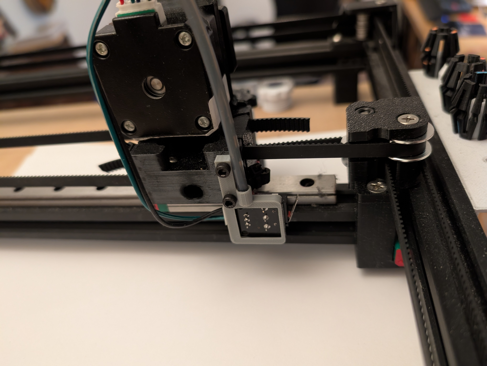

The Y axis is hit by the moving extrusion.

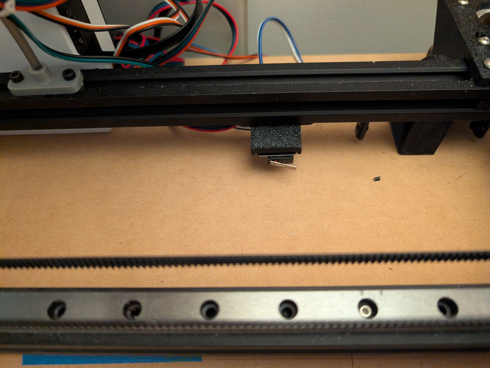

Mount using a bracket on the extrusion:

import switch_extrusion_mount from "./switch-extrusion-mount.png";

<Image width={600} alt="Limit switch Y Axis Mount" src={switch_extrusion_mount} />

There's a third switch on the pen lift.

# Pen lift

This took a lot of iterations - both for the vertical motion and for the pen holder.

## Pen motion

I wanted the pen motion to be fast and quiet. The kit I bought used linear bearings, a servo motor and a rubber band to pull down the pen. The small bearings had too much play, so I first tried bigger LM06uu:

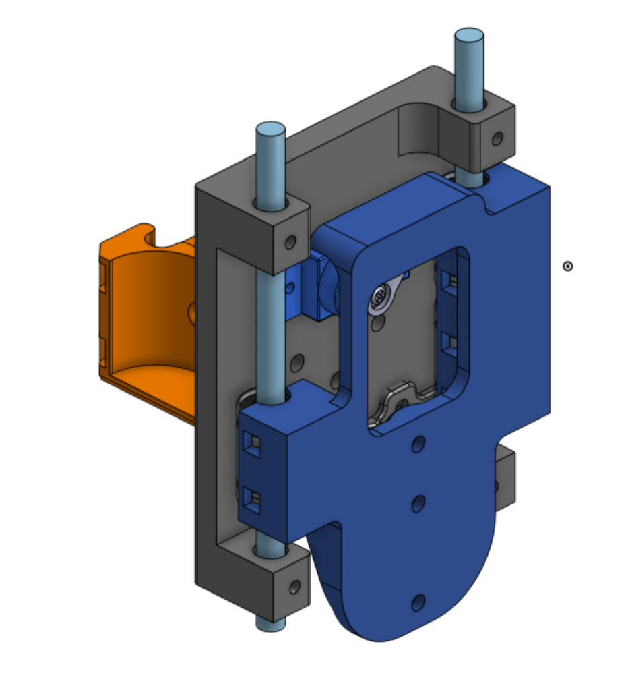
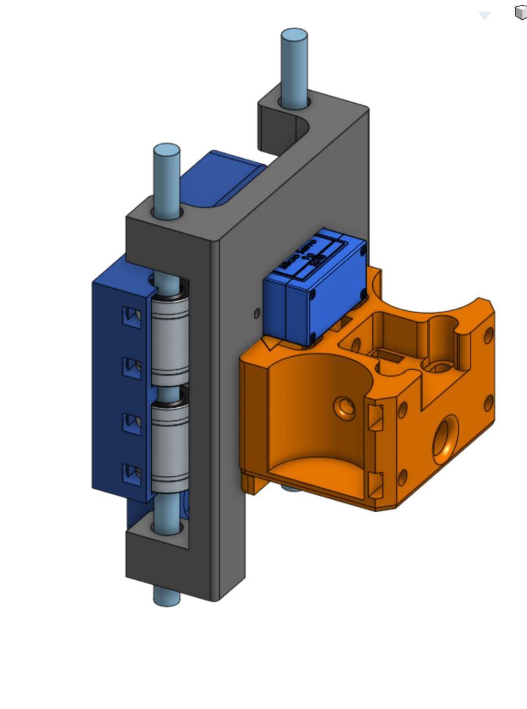

You might notice the servo must be inserted from the front in this design - which is a terrible idea. As I didn't add any clearance for the servo _wire_, I had to disassemble the servo itself to mount it.

I tried with two bearings at first, and it lacked rigidity. Four was too many and was binding ; three was the sweet spot. The design is _ok_ but a bit heavy, linear bearings are still noisy, and the servo is even worse.

I replaced the linear bearings with a linear guide, which is much smoother and quieter.

import lift_servo_guide_front from "./lift-servo-guide-front.png";
import lift_servo_guide_back from "./lift-servo-guide-back.png";

<Image width={600} alt="lift linear guide front" src={lift_servo_guide_front} />
<Image width={600} alt="lift linear guide back" src={lift_servo_guide_back} />

It left the servo, so I tried a stepper motor, which is way more quieter and very accurate. It does require another limit switch for homing however. I experimented with switch-less homing but it was not reliable enough for my liking.

Because I just cannot iterate reasonably on a design I tried a belt system, but eventually abandonned that idea - I liked the idea of being able to toggle the down motion on and off for a potential knife attachment, but I eventually realized I still didn't have a machine working.

import lift_stepper_belt from "./lift-stepper-belt.png";

<Image width={600} alt="lift linear guide front" src={lift_stepper_belt} />

Back to a linear guide, with the stepper: this is the design I kept.

import lift_stepper_guide_front from "./lift-stepper-guide-front.png";
import lift_stepper_guide_back from "./lift-stepper-guide-back.png";

<Image width={600} alt="lift linear guide front" src={lift_stepper_guide_front} />
<Image width={600} alt="lift linear guide back" src={lift_stepper_guide_back} />

The stepper has a custom arm with a bearing mounted on it.

{/* TODO: add lift-stepper-guide-arm.png, then uncomment
import lift_stepper_guide_arm from "./lift-stepper-guide-arm.png";
<Image alt="bearing on arm" src={lift_stepper_guide_arm} />
*/}

## Pen holder

- Starting point: the kit's screw pushing the pen against a bracket.
- Problem: swapping to a pen of a different diameter moves the tip, so every pen change means re-zeroing.

{/* TODO fill in - the thread to pick up is line "it makes any pen change complicated if the two pens don't have the same diameter":
- what replaced the screw-against-a-bracket? collet, split clamp with a pinch screw, magnetic quick-release, printed adapter sleeves per pen family?
- how is the tip height set now - does the holder reference the pen tip, the pen body, or is it still set by hand each time?
- what pen range does it have to swallow (fineliner ~8mm up to a marker ~18mm?) and did one holder cover it or is it a set of adapters?
- spring-loaded tip or hard down-stop? if sprung: what keeps the line width constant across the sheet?
- how many revisions before this one, and what failed in the ones before - slipping, tilt, pen dropping on travel moves?
*/}

# FluidNC controller

- Replaces the Arduino CNC shield of the kit.
- Two reasons to move: GRBL on an 8-bit MCU was the speed ceiling, and the a4988s were the loudest thing on the machine after the servo.

{/* TODO fill in - the threads to pick up are "GRBL on an old 8-bit MCU is slow", "a4988, which are noisy" and "servo mapped to M3 is a pain in some software":
- which board? (bare ESP32 + breakout, or one of the FluidNC-ready boards) and why that one
- which drivers, and how much of the noise actually went away
- what did the speed/acceleration go from and to - is the machine now limited by the electronics, the frame, or the pen?
- config-file-instead-of-recompiling: how much did that change the iteration loop, given how many lift designs were tried above
- the pen lift is a stepper now: is it a real axis in the config, and did that solve the M3/servo mapping annoyance?
- homing: three switches, what's the homing order and does the lift home first for clearance?
- WiFi/web UI - actually used day to day, or still sending over USB?
- anything that was worse than GRBL?
*/}

## Case

{/* TODO fill in - nothing written yet, all open:
- printed or laser cut? mounted on the frame, under the board, or standalone on the desk?
- what's in it - board, PSU, drivers, fan? any cooling needed?
- cable management: the gantry has a bowden tube for the drag chain, where do the wires land and are there connectors or is it soldered through?
- power switch / e-stop
- what you'd do differently
*/}

## Pendant

{/* TODO fill in - nothing written yet, all open:
- what is it - jog wheel/MPG, macro keypad, a screen? bought or built?
- what does it actually get used for: jogging to set origin, pen-down height, pausing mid-plot for a pen change?
- how does it talk to FluidNC - UART, I2C, WiFi, or as a plain USB HID somewhere else?
- was it worth building versus just using the web UI?
*/}

#  Tangential Knife

- Picks up the idea abandoned during the belt lift experiment: being able to toggle the down motion on and off.
- Extra constraint a pen doesn't have: the blade must be steered to face the direction of travel, so it needs a rotary axis.

<Animation src="tangential-knife" auto="hover" caption="Same toolpath, three ways through its corners: a drag knife dragged into line by the material, the same knife told to overshoot and loop back so it arrives already facing the right way, and a tangential knife that stops and turns its rotary axis. Blade offset exaggerated; the compensated one is still cutting when the other two have finished." />

{/* TODO fill in:
- what it's for - vinyl, card, paper stencils? what couldn't be done with a drag knife?
- drag knife vs tangential: why the extra rotary axis was worth it
- the rotary axis: motor, gearing/belt reduction, how the blade is held, how it's zeroed
- lift and cut depth - is this the same stepper lift as the pen, or its own?
- toolpath side: who computes the knife angle - post-processor, FluidNC, custom code? corners: lift-and-turn or turn-in-place?
- where it stands: working, prototype, or shelved?
*/}

## Magnetic encoder prototype

{/* TODO fill in - nothing written yet, all open:
- what problem forced a closed loop on the rotary axis - skipped steps under cutting load, or just no home switch for a continuously rotating shaft?
- which encoder and how the magnet is mounted on the shaft
- what reads it and where the loop closes - on the FluidNC board or a separate MCU?
- measured accuracy vs what the knife actually needs
- prototype outcome: kept, or replaced by a simpler homing trick?
*/}
