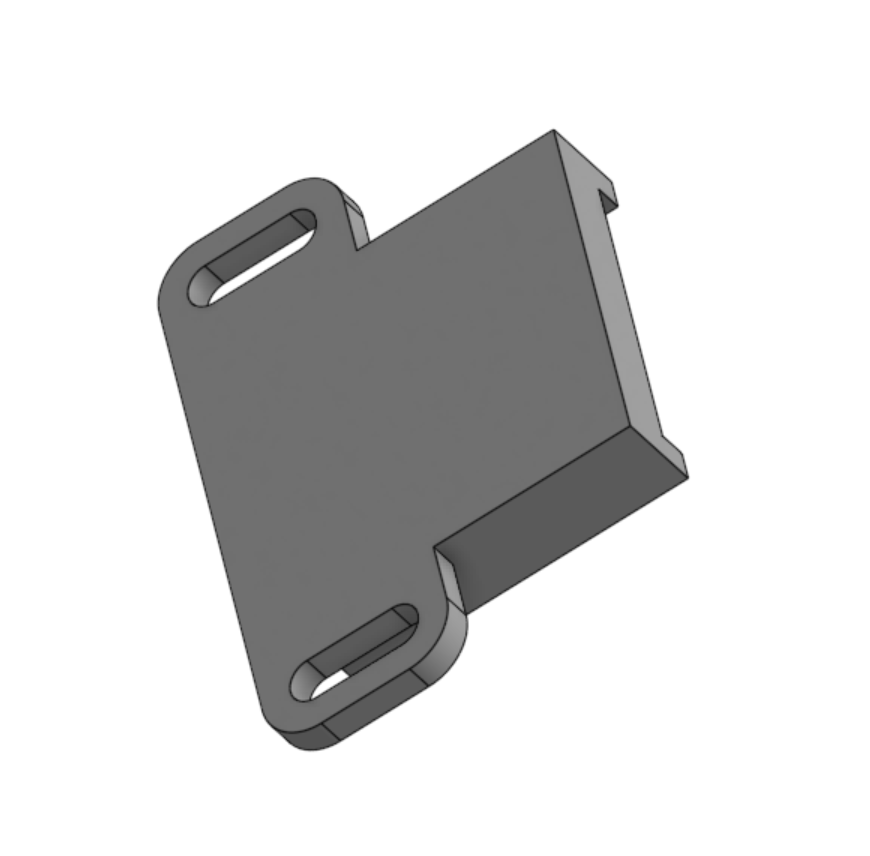

import { Image } from 'astro:assets';

I built a pen plotter and spent a lot of time fine-tuning it - from tweaking an existing design to designing a tangential knife.

<Video src={import("./banner.mp4")} />

# Starting with a cheap kit

I started with a basic kit from AliExpress, sometimes named "LY Drawbot", as I was not sure it was for me. It was a bad choice. Let's have a look at the design and the parts that came with it.

The machine is a T-shaped one like the AxiDraw, a core xy design with steppers on both ends of the X axis, and a Y axis mounted on the gantry. 

Both axis use linear bearings. I don't know how much difference there is between a cheap bearing and an expensive one ; the ones in the kits are noisy, have play and do not produce smooth movement. 

The gantry is a couple of laser cut acrylic plates, with tie wraps to secure the bearings. The play in there leads to the pen height varying a lot then it moves on the Y axis. 

The controller is an arduino cnc shield. GRBL on an old 8-bit MCU is slow but it works. The stepper drivers are a4988, which are noisy.

The kit does not come with end stops: you have to zero the machine by hand.

The pen lift uses a servo. They're noisy and fragile, but cheap and don't require another stepper driver. They're usually mapped to the GCode M3 command, which can be a pain in some software. 
The movement is accomplished with small linear bearings and a rubber band. In my experience smaller *cheap* linear bearings have proportionally even more play.

The pen is secured with a screw pushing it against a bracket. It's...ok, but I realized later that it makes any pen change complicated if the two pens don't have the same diameter.

All in all, it's a reasonable starting kit... but I wanted a quieter, faster, more accurate machine.

# Using a different design

I stumbled upon Lehaiver's CoreXY frame on thingiverse [here](https://www.thingiverse.com/thing:2138286). It's an elegant design:

CoreXY kinematics with linear guides on 20mm aluminum extrusions. I ended up redesigning most of the parts in OnShape from scratch, but it's a great starting point. The linear guides are a huge improvement over the linear bearings, and the aluminum extrusions bring a lot of rigidity.

## Gantry

Lehaiver made a [Laser mount](https://www.thingiverse.com/thing:2685298) with a dove tail plate that I tweaked to fit a pen lift. Belts are easier to tighten on this one.

 I also added a couple of captive nuts to fasten a bowden tube for cable management and a limit switch.

## Limit switches

Speaking of limit switches: I added one on each axis. The Y axis switch is mounted on the gantry with the mount shown above, and the X axis one is mounted on the frame. As it's only a plotter and not a CNC, I'm ok with one switch per axis.

The gantry switch hits the X axis end.

The Y axis is hit by the moving extrusion.

Mount using a bracket on the extrusion:

There's a third switch on the pen lift.

# Pen lift

This took a lot of iterations - both for the vertical motion and for the pen holder.

## Pen motion

I wanted the pen motion to be fast and quiet. The kit I bought used linear bearings, a servo motor and a rubber band to pull down the pen. The small bearings had too much play, so I first tried bigger LM06uu:

You might notice the servo must be inserted from the front in this design - which is a terrible idea. As I didn't add any clearance for the servo _wire_, I had to disassemble the servo itself to mount it.

I tried with two bearings at first, and it lacked rigidity. Four was too many and was binding ; three was the sweet spot. The design is _ok_ but a bit heavy, linear bearings are still noisy, and the servo is even worse.

I replaced the linear bearings with a linear guide, which is much smoother and quieter.

import lift_servo_guide_front from "./lift-servo-guide-front.png";
import lift_servo_guide_back from "./lift-servo-guide-back.png";

<Image width={600} alt="lift linear guide front" src={lift_servo_guide_front} />
<Image width={600} alt="lift linear guide back" src={lift_servo_guide_back} />

It left the servo, so I tried a stepper motor, which is way more quieter and very accurate. It does require another limit switch for homing however. I experimented with switch-less homing but it was not reliable enough for my liking.

Because I just cannot iterate reasonably on a design I tried a belt system, but eventually abandonned that idea - I liked the idea of being able to toggle the down motion on and off for a potential knife attachment, but I eventually realized I still didn't have a machine working.

import lift_stepper_belt from "./lift-stepper-belt.png";

<Image width={600} alt="lift linear guide front" src={lift_stepper_belt} />

Back to a linear guide, with the stepper: this is the design I kept.

import lift_stepper_guide_front from "./lift-stepper-guide-front.png";
import lift_stepper_guide_back from "./lift-stepper-guide-back.png";

<Image width={600} alt="lift linear guide front" src={lift_stepper_guide_front} />
<Image width={600} alt="lift linear guide back" src={lift_stepper_guide_back} />

The stepper has a custom arm with a bearing mounted on it.

import lift_stepper_guide_arm from "./lift-stepper-guide-arm.png";

<Image alt="bearing on arm" src={lift_stepper_guide_arm.png} />

## Pen holder

# FluidNC controller

## Case

## Pendant

#  Tangential Knife

## Magnetic encoder prototype
