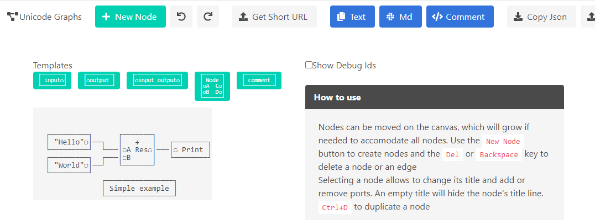
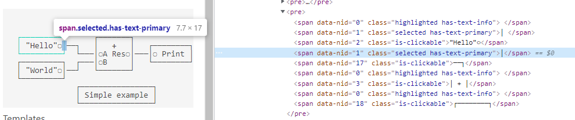

import Video from "../../../components/Video.astro";



At work, I used to write a _lot_ of unit tests that would create a graph, then act on it. A bit of ASCII art can go a long way to quickly get the point of the graph ; I eventually got bored by drawing them by hand and wrote a visual tool to do it: https://unicode-graphs.netlify.app/

This is the type of comments we'd write by hand:

```csharp
//    ┌─────────┐      ┌───────┐
//    │ "Hello"◌│──┐   │   +   │   ┌────────┐
//    └─────────┘  └───│◌A Res◌│───│◌ Print │
//    ┌─────────┐  ┌───│◌B     │   └────────┘
//    │ "World"◌│──┘   └───────┘
//    └─────────┘
//                 ┌────────────────┐
//                 │ Simple example │
//                 └────────────────┘
public void Test ()
{
    Graph g = new Graph();
    var print = g.AddNode<PrintNode>();
    var add = g.AddNode<AddNode>();
    var hello = g.AddConstantNode("Hello");
    var world = g.AddConstantNode("World");

    g.connect(hello.output, add.inputA);
    g.connect(world.output, add.inputB);
    g.connect(add.output, print.input);

    g.AddCommentNode("Simple example", x:30, y:20);
    /* ... */
}
```

Here is the tool I wrote, a single page webapp (written in [F#+Elmish of course](/tech-stack-graph-unicode-fsharp)):

<Video src={import("./demo.mp4")} />

I even get a URL embedding the graph itself so I can edit it again later :

https://unicode-graphs.netlify.app/#/graph/BCJNGEBw37QAAADBAgAFAAAAAQAAAAADBAAACwCQAgciSGVsbG8iEgBgASsAAAAUCgDQAgAAAAQBQQAAAAUBQigA8AUGA1JlcwAAAA0OU2ltcGxlIGV4YQgAgAAAABAAAAAJVgAgAA4GAABcABEGZwCADwciV29ybGRcABASGwARIFYA8AIAAAATBiBQcmludAAEAAAABxsAATEAIAADawAAUAATAEwAABAAFxEgAAALAAChAJAAAAMAAAAAEgAAAAAA

More about the ugly compression scheme later.

# The tool

The graph itself is a simple collection of nodes with ports and a collection of edges (see the Serialization section below). Each node, edge and port has a unique Id. To make edge management easier, edges are stored as two tuples of `NodeId` and `portIndex`.

```fsharp
type Graph =
    { nodes: Map<Id, Node>
      edges: Map<Id, Edge> }

[<Struct>]
type Node =
    { title: string
      id: Id
      pos: Pos
      inputs: Port List
      outputs: Port List }

[<Struct>]
type Edge =
    { id: Id
      fromNode: Id * uint8 // node id and output port index
      toNode: Id * uint8 // node id and input port index
      offset: int8 } // for rendering only

[<Struct>]
type Port = { title: string; id: Id }

[<Struct>]
type RenderOptions =
    { CanvasWidth: int option
      CanvasHeight: int option
      ActualCanvasWidth: int
      ActualCanvasHeight: int
      ShowIds: bool }
```

After any graph change, there's a two-pass process to render it again. First, nodes are measured, according to their title, port count and port label width. The aggregated size will be used as the size of the "character canvas" at the end. A bunch of port data is computed and cached at this point to ease port and edge rendering later. The code ain't exactly pretty:

```fsharp
// measure each line of the node, eg. the input and output ports on the same line
let portWidth =
    for i in 0 .. Math.Max(n.inputs.Length, n.outputs.Length) - 1 do
        match List.tryItem i n.inputs, List.tryItem i n.outputs with
        | Some (inputPort), Some (outputPort) ->
            inputPort.title.Length
            + outputPort.title.Length
            + 3 // 2 * port connector character + space between port labels
            + 2 // 2 * border character
        | Some (x), None
        | None, Some (x) ->
            // 1 connector, 1 space on the other side, 2 borders
            x.title.Length + 1 + 1 + 2
```

Then comes the "rasterization": an array of `char` and `id` tuples is created using the canvas size measured earlier, then the graph is "drawn" in that framebuffer.
The array is then transformed into a `div` with one `pre` per line, each line containing multiple spans to allow multiple colors:



The framebuffer also contains the ID of the owning entity of each character, to change the node/edge/port color when hovered or selected :

<Video src={import("./hover-select.mp4")} height="300px" />

```fsharp
let makeSpan () =
    span
        (seq {
            yield Data("nid", id.Value) // the id is stored as an HTML attribute

            if id.Value <> 0u then yield Class "is-clickable"

            if editable && model.selectedId = Some(id) then yield Class "selected has-text-primary"

            if editable && model.highlightedId = Some(id)
                && model.highlightedId <> model.selectedId then
                yield Class "highlighted has-text-info"
            })
```

That data is used later by OnMouseClick/OnMouseMove/... handlers to determine which entity to highlight, select, move, etc. This is the picking function:

```fsharp
let getId (e: MouseEvent): Id option =
    let elem = e.target :?> HTMLElement
    if not <| JsInterop.isNullOrUndefined elem then
        match elem.dataset.Item "nid" with
        | ""
        | s when JsInterop.isNullOrUndefined s -> None
        | s -> UInt32.Parse s |> Id |> Some
    else
        None
```

The drag and drop, including edge creation, is done similarly.

<Video src={import("./edge.mp4")} height={114} />

Any authoring tool I've seen ends up with that kind of state, one way or another.

```fsharp
type Model =
    { graph: Graph
      options: RenderOptions // canvas size, debug options, ...
      nodeSizes: Map<Id, Rect> // size cache
      ports: Map<Id, PortEntry> // port data cache
      highlightedId: Id option // hovered node/edge
      selectedId: Id option // selected node/edge
      deltaPos: Pos option // for drag and drop
      edgeCandidate: Pos option // when creating an edge, the temporary one drawn
      isBurgerOpen: bool // navbar menu
      Debouncer: Debouncer.State // avoid too many graph serialization/compressions and url updates
      GraphState: GraphState (* ready or waiting for a layout *) }
```

There are also a bunch of shortcuts (delete, undo, redo, duplicate) and premade templates (typical nodes with/without title, ports, etc.)

<Video src={import("./templates.mp4")} height={298} />

Undo/redo is implemented using the browser history - that felt very satisfying when I realized that would work, thanks to the graph serialization in the URL.

# Graph serialization and compression

This is the fun part. As the app is serverless, the entire graph needs to be encoded in the URL, which means printable characters only.

The graph structure looks like that:

```fsharp
type SerializationModel =
    { options: RenderOptions
      nodes: Node array
      edges: Edge array }

```

If we look at the previous graph, this is the raw json:

```json
{
  "options": {
    "ActualCanvasWidth": 42,
    "ActualCanvasHeight": 12,
    "ShowIds": false
  },
  "nodes": [
    {
      "title": "",
      "guid": 1,
      "pos": [3, 3],
      "inputs": [],
      "outputs": [{ "title": "\"Hello\"", "guid": 2 }]
    },
    {
      "title": "+",
      "guid": 3,
      "pos": [20, 3],
      "inputs": [
        { "title": "A", "guid": 4 },
        { "title": "B", "guid": 5 }
      ],
      "outputs": [{ "title": "Res", "guid": 6 }]
    },
    {
      "title": "Simple example",
      "guid": 13,
      "pos": [16, 9],
      "inputs": [],
      "outputs": []
    },
    {
      "title": "",
      "guid": 14,
      "pos": [3, 6],
      "inputs": [],
      "outputs": [{ "title": "\"World\"", "guid": 15 }]
    },
    {
      "title": "",
      "guid": 18,
      "pos": [32, 4],
      "inputs": [{ "title": " Print", "guid": 19 }],
      "outputs": []
    }
  ],
  "edges": [
    {
      "id": 7,
      "fromNode": [1, "0"],
      "toNode": [3, "1"],
      "isNodeEdge": false,
      "offset": "0"
    },
    {
      "id": 16,
      "fromNode": [14, "0"],
      "toNode": [3, "1"],
      "isNodeEdge": false,
      "offset": "0"
    },
    {
      "id": 17,
      "fromNode": [1, "0"],
      "toNode": [3, "0"],
      "isNodeEdge": false,
      "offset": "0"
    },
    {
      "id": 20,
      "fromNode": [3, "0"],
      "toNode": [18, "0"],
      "isNodeEdge": false,
      "offset": "0"
    }
  ]
}
```

Minimified, that's a whole 884 characters, some of them not fit for a URL. If we base64 to fix that issue:

```
eyJvcHRpb25zIjp7IkFjdHVhbENhbnZhc1dpZHRoIjo0MiwiQWN0dWFsQ2FudmFzSGVpZ2h0IjoxMiwiU2hvd0lkcyI6ZmFsc2V9LCJub2RlcyI6W3sidGl0bGUiOiIiLCJndWlkIjoxLCJwb3MiOlszLDNdLCJpbnB1dHMiOltdLCJvdXRwdXRzIjpbeyJ0aXRsZSI6IiJIZWxsbyIiLCJndWlkIjoyfV19LHsidGl0bGUiOiIrIiwiZ3VpZCI6MywicG9zIjpbMjAsM10sImlucHV0cyI6W3sidGl0bGUiOiJBIiwiZ3VpZCI6NH0seyJ0aXRsZSI6IkIiLCJndWlkIjo1fV0sIm91dHB1dHMiOlt7InRpdGxlIjoiUmVzIiwiZ3VpZCI6Nn1dfSx7InRpdGxlIjoiU2ltcGxlIGV4YW1wbGUiLCJndWlkIjoxMywicG9zIjpbMTYsOV0sImlucHV0cyI6W10sIm91dHB1dHMiOltdfSx7InRpdGxlIjoiIiwiZ3VpZCI6MTQsInBvcyI6WzMsNl0sImlucHV0cyI6W10sIm91dHB1dHMiOlt7InRpdGxlIjoiIldvcmxkIiIsImd1aWQiOjE1fV19LHsidGl0bGUiOiIiLCJndWlkIjoxOCwicG9zIjpbMzIsNF0sImlucHV0cyI6W3sidGl0bGUiOiIgUHJpbnQiLCJndWlkIjoxOX1dLCJvdXRwdXRzIjpbXX1dLCJlZGdlcyI6W3siaWQiOjcsImZyb21Ob2RlIjpbMSwiMCJdLCJ0b05vZGUiOlszLCIxIl0sImlzTm9kZUVkZ2UiOmZhbHNlLCJvZmZzZXQiOiIwIn0seyJpZCI6MTYsImZyb21Ob2RlIjpbMTQsIjAiXSwidG9Ob2RlIjpbMywiMSJdLCJpc05vZGVFZGdlIjpmYWxzZSwib2Zmc2V0IjoiMCJ9LHsiaWQiOjE3LCJmcm9tTm9kZSI6WzEsIjAiXSwidG9Ob2RlIjpbMywiMCJdLCJpc05vZGVFZGdlIjpmYWxzZSwib2Zmc2V0IjoiMCJ9LHsiaWQiOjIwLCJmcm9tTm9kZSI6WzMsIjAiXSwidG9Ob2RlIjpbMTgsIjAiXSwiaXNOb2RlRWRnZSI6ZmFsc2UsIm9mZnNldCI6IjAifV19
```

1173 characters. That's worse, by 33%, which is exactly the Base64 encoding overhead. B64 can hold 6 bits of information per printable character, meaning you four bytes (24 bits of actual data) to encode 3 bytes of actual data.

My use case is highly specific, as the data won't change much and has, among its requirements, to be fun to do (I already have a day job), so let's write a binary serializer. It's inspired by [MessagePack](https://msgpack.org/), [Protobuf](https://developers.google.com/protocol-buffers) and others:

- write a `bool` as a `byte`
- sequences are prefixed by their count
- a string is a sequence of chars
- I tried varints ; most of my ints are in the byte range, so it doesn't help

```fsharp
let serialize (m: SerializationModel) =
    state {
        do! writeUInt8 lastVersion
        do! writeBool m.options.ShowIds
        do! writeSeq m.nodes writeNode
        do! writeSeq m.edges writeEdge

        let! s = getState
        return s.offset
    }
```

Notice how I said my protocol wouldn't change and **still** had to add a scheme version in the data.

The (de)serialization functions are written using a [State monad (mmhaskell article)](https://mmhaskell.com/monads/state) and fills a [JS DataView (mdn page)](https://developer.mozilla.org/en-US/docs/Web/JavaScript/Reference/Global_Objects/DataView).

Here is the resulting buffer, base64'd:

```
AgAFAAAAAQAAAAADAAAAAwABAAAAAgciSGVsbG8iAAAAAwErAAAAFAAAAAMCAAAABAFBAAAABQFCAQAAAAYDUmVzAAAADQ5TaW1wbGUgZXhhbXBsZQAAABAAAAAJAAAAAAAOAAAAAAMAAAAGAAEAAAAPByJXb3JsZCIAAAASAAAAACAAAAAEAQAAABMGIFByaW50AAQAAAAHAAAAAAABAAAAAAMBAAAAEAAAAAAADgAAAAADAQAAABEAAAAAAAEAAAAAAwAAAAAUAAAAAAADAAAAABIA
```

285 characters. Compared to the initial json+b64, that's 24% of the initial 1173 characters.

I then tried to compress the buffer before the b64 using [lz4js (github)](https://github.com/Benzinga/lz4js), which without surprise is a js implementation of [Lz4 (github)](https://github.com/lz4/lz4). Result: 261 characters after b64.

```
BCJNGEBw37QAAADBAgAFAAAAAQAAAAADBAAACwCQAgciSGVsbG8iEgBgASsAAAAUCgDQAgAAAAQBQQAAAAUBQigA8AUGA1JlcwAAAA0OU2ltcGxlIGV4YQgAgAAAABAAAAAJVgAgAA4GAABcABEGZwCADwciV29ybGRcABASGwARIFYA8AIAAAATBiBQcmludAAEAAAABxsAATEAIAADawAAUAATAEwAABAAFxEgAAALAAChAJAAAAMAAAAAEgAAAAAA
```

That's the best I'll do for now; compression is one of those topics I know just enough about to know there's much more to learn.

The tool is available here: [https://unicode-graphs.netlify.app/](https://unicode-graphs.netlify.app/).
